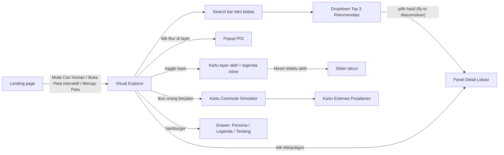

# Analisis UI/UX NalarRuang

Versi 1.0 · 27 September 2026 · Dasar: 12 screenshot desain (1 landing page + 11 layar aplikasi) dibandingkan dengan SRS, WBS, Charter, dan Deskripsi.

Dokumen ini memetakan alur, pola, dan gaya visual yang dipakai desain, lalu mencatat bagian mana yang sejalan, menyimpang, atau belum ada dibanding SRS. Temuan di sini menjadi masukan untuk prompt PRD dan prompt design system.

## 0. Kebijakan desain (berlaku untuk semua pembaca dan AI agent)

Keputusan tim, 27 September 2026:

1. **Gaya visual desain dilindungi dan tidak diubah.** Warna (UI dan data peta), tipografi (termasuk serif di landing), ukuran, radius, bayangan, efek kaca/blur/opasitas, ikon dan warnanya, fotografi, basemap, bentuk komponen, tata letak yang sudah digambar, dan nada bahasa microcopy dipakai persis seperti desain. Ini bentuk penghargaan kepada pembuat desain.
2. **Yang belum didesain diimprovisasi langsung oleh AI**, tanpa menunggu desain baru. Improvisasi wajib meniru komponen, token, dan alur yang sudah ada, dan tidak boleh memperkenalkan warna, font, radius, bayangan, atau gaya ikon baru.
3. **Masalah fungsi (bukan gaya) tetap diselesaikan** dengan cara yang tidak mengubah tampilan: aturan bisnis SRS (mis. multi-persona), satu seleksi aktif, elemen yang tertutup tetap bisa dijangkau, teks yang diisi data harus sesuai datanya.
4. Temuan gaya di bagian 7.3, 7.4, dan sebagian 7.5 hanya **catatan observasi**. Tidak ada satu pun yang boleh dijadikan alasan mengubah desain.

---

## 1. Inventaris layar

| File | Isi layar | Keadaan yang diperlihatkan |
|---|---|---|
| `Landing_Pagee.png` | Landing page (halaman pemasaran) | Seluruh halaman dari hero sampai footer |
| `Top_3_Rekomendasi.png` | Visual Explorer + dropdown hasil pencarian | Search bar terbuka dengan "TOP 3 REKOMENDASI", semua layer mati, tanpa Point Inspector |
| `Desktop_-_6.png` | Drawer menu utama | Tab Persona aktif, Social & Vibe tercentang, peta di belakang di-blur |
| `all.png` | Point Inspector | Titik "Shangri-La Hotel", semua layer mati |
| `inklusivitas.png` | Point Inspector + Layer Inklusivitas | Wilayah "Depok", titik biru "RSUI Depok" |
| `ekowisata.png` | Point Inspector + Layer Ekosistem Mikro | "Telkom Bekasi" di Inspector, popup POI "Summarecon Mall (Bks)" terbuka bersamaan |
| `historis.png` | Point Inspector + Layer Historis & Risiko | "Jembatan 1", poligon merah "Area Banjir Tinggi" |
| `transit.png` | Point Inspector + Layer Mobilitas & Transit | Jalur KRL/MRT/LRT berwarna-warni, marker stasiun |
| `visioner.png` | Point Inspector + Layer Mesin Waktu | Garis putus-putus "Proyek LRT (Fase 2)", slider "Tahun 2029" |
| `legalitas.png` | Point Inspector + Layer Legalitas Lahan | "RW 04", persegi ungu "Zona Perkantoran" |
| `VISUAL_EXPLORER.png` | Semua layer aktif | Persona sesi Social & Vibe, popup "Area Banjir Tinggi" |
| `simulator.png` | Commute Simulator | Rute Perpustakaan Diploma IPB → Botani Square, kartu estimasi dua moda |

## 2. Alur pengguna yang tersirat dari desain

Desain belum memperlihatkan dari mana pengguna memilih persona pertama kali. Landing page mengajak "Pilih persona, buka peta", tetapi dialog onboarding (UI00, FR-13) tidak ada di layar mana pun. Satu-satunya tempat memilih persona adalah tab Persona di drawer menu.

## 3. Dua bahasa visual yang berbeda

Desain terdiri dari dua permukaan yang gaya visualnya hampir tidak berbagi apa pun.

| Aspek | Landing page | Aplikasi peta |
|---|---|---|
| Nuansa | Editorial, majalah arsitektur, tenang | Glassmorphism modern, panel melayang |
| Tipografi | Serif kontras tinggi untuk judul (termasuk italic), sans lain untuk body (mirip Inter) | Sans geometris (sesuai Plus Jakarta Sans) |
| Warna dominan (sampel screenshot, perkiraan) | Krem `#F8F5EE`, navy `#0E1B3D`/`#121D3D`, navy gelap `#0A1020`, marun `#771627`, oranye aksen `#BE5400` | Cyan `#00A8DD`, teks slate `#1D293D`, teks redup `#6A7B93`, bintang rose/merah muda, panel putih transparan |
| Fotografi | Foto kota Jakarta, sebagian besar hitam-putih | Tidak ada, peta OSM standar sebagai latar |
| Indikator skor | Belah ketupat ◆◆◇ | Bintang ★★☆ |

Akibatnya, pengguna berpindah dari landing ke peta seperti masuk ke produk lain. Design system perlu satu fondasi token yang sama dengan dua "tema permukaan" (editorial dan peta), bukan dua sistem terpisah.

## 4. Yang sudah sejalan dengan SRS

- Peta interaktif layar penuh berbasis Leaflet + OpenStreetMap, dengan atribusi Leaflet/OSM tetap tampil (wajib secara lisensi).
- Enam layer dengan nama persis sesuai SRS, masing-masing bisa di-toggle mandiri (FR-03).
- Slider tahun muncul hanya saat Layer Mesin Waktu aktif (FR-04), rentang 2026–2030.
- Search bar teks bebas dengan contoh placeholder bergaya SRS ("Ketik 'Daerah asri di Bogor'...") (FR-05).
- Hasil pencarian tepat tiga (BR-1).
- Ikon orang berjalan di sebelah search bar untuk masuk ke Commute Simulator (FR-16), dengan dua moda: transportasi publik dan mobil pribadi (FR-11).
- Point Inspector berisi empat persona dengan skala tiga bintang dan kesimpulan singkat (FR-09, FR-17).
- Menu utama berisi tiga sub-menu yang setara dengan SRS: Persona, Legenda, Tentang (FR-18), dan persona bisa diubah tanpa memuat ulang (FR-19; teksnya "mengubah rekomendasi di peta secara instan").
- Landing page mencantumkan disclaimer "Skor dan rekomendasi merupakan estimasi dari data sekunder publik" serta FAQ tanpa login dan sumber data publik, sejalan dengan B07 dan 5.2.

## 5. Penyimpangan dari SRS

| # | Area | SRS | Desain | Rekomendasi |
|---|---|---|---|---|
| D1 | Posisi search bar | Pojok kanan atas (UI01) | Tengah atas | Ikuti desain, revisi UI01. Posisi tengah lebih dekat pola Google Maps dan tidak bertabrakan dengan panel layer. |
| D2 | Posisi panel layer | Kanan bawah (UI01) | Sisi kanan, hampir setinggi layar | Ikuti desain, revisi UI01. Panel harus bisa di-scroll bila tinggi layar kurang. |
| D3 | Tombol tutup Point Inspector | Sisi kiri panel (FR-08) | Kanan atas panel | Ikuti desain (panel sendiri berada di kiri layar), revisi kalimat FR-08. |
| D4 | Bentuk menu utama | "Menu" dengan tiga sub-menu | Drawer kiri modal dengan tiga tab, peta di-blur | Ikuti desain. |
| D5 | Ikon toggle Commute | Orang berjalan (UI02) | Orang berjalan di 5 layar, ikon "rute/slider" di 3 layar lain | Satu ikon saja. Karena SRS menyebut orang berjalan dan ikon slider biasanya berarti filter, pakai orang berjalan atau ikon rute yang jelas. |
| D6 | Persona jamak | Boleh lebih dari satu persona (FR-13, FR-14); auto-summary untuk tiap persona terpilih (FR-17, BR-11) | Hanya satu baris berlabel "PROFIL ANDA" dan satu kesimpulan; persona lain diredupkan | Desain harus mendukung beberapa persona sekaligus: beberapa badge "PROFIL ANDA" dan satu kalimat kesimpulan per persona terpilih. |
| D7 | Estimasi biaya | FR-11 hanya jarak dan waktu tempuh | Menambah biaya (Rp 3.000, Rp 18.187) dan keterangan "Berdasarkan tarif resmi KRL" | Masuk cakupan mengikuti desain; SRS direvisi. Sumber data biaya menjadi open question data, dan keterangan di bawah moda diisi sesuai sumber data sebenarnya. |
| D8 | Landing page | Tidak ada di UI00–UI05 | Halaman lengkap 11 bagian | Masuk cakupan sebagai fitur pendukung mengikuti desain; SRS direvisi. |
| D9 | Tipografi | Hanya Plus Jakarta Sans (B03) | Landing memakai serif display dan sans lain untuk body | Ikuti desain apa adanya (kebijakan bagian 0). Aplikasi tetap Plus Jakarta Sans seperti desainnya; landing memakai font sesuai desain. B03 direvisi mengikuti desain. |
| D10 | Legalitas Lahan | Legalitas lahan / batas persil ATR/BPN (WBS 1.3.1) | Diwujudkan sebagai zona peruntukan ("Zona Perkantoran") | Perlu diperjelas: status legalitas persil atau zonasi RDTR. Keduanya data berbeda. |

## 6. Kebutuhan SRS yang belum punya desain

Semua item di tabel ini diimprovisasi langsung oleh AI mengikuti gaya dan alur desain yang ada (kebijakan bagian 0).

| Kebutuhan | Rujukan | Catatan |
|---|---|---|
| Dialog onboarding persona awal sesi, minimal satu wajib dipilih, dengan peringatan | UI00, FR-13, BR-7 | Tidak ada. Drawer Persona bisa dijadikan dasar visualnya. |
| Mode checkbox kota + persona pada pencarian | FR-15, UI02 | Tidak ada. |
| Keadaan input Commute Simulator (mengisi dua kolom atau menaruh Pin A/B) | FR-10 | Desain hanya memperlihatkan hasil; kolom tampil sebagai teks terisi, bukan input. |
| Highlight/dim area sesuai filter | FR-02 | Tidak terlihat; peta tidak meredup saat layer aktif. |
| Animasi fly-to setelah memilih rekomendasi | FR-07 | Tidak ada keadaan setelah memilih hasil. |
| Konten tab Legenda dan Tentang | FR-20, FR-21 | Hanya tab-nya yang ada. |
| Empty, loading, dan error state | UC-01 s.d. UC-07 | Tidak ada satu pun: "tidak ditemukan rekomendasi", "data tidak tersedia", "estimasi tidak tersedia", "data tidak lengkap", gagal memuat layer, gagal menyimpan preferensi. |
| Tampilan skor 0 bintang | BR-9 | Tidak jelas apakah tiga bintang kosong atau ada label. |
| Perbedaan penilaian titik vs wilayah | FR-09, BR-10 | Aplikasi tidak memberi tanda apakah yang dipilih titik atau poligon. Landing justru punya tab "TITIK / WILAYAH" yang bagus dan bisa dibawa ke aplikasi. |
| Ringkasan informasi lokasi | FR-08 | Point Inspector hanya berisi nama dan alamat, tanpa ringkasan data layer di lokasi itu. |

## 7. Temuan UX dan aksesibilitas

### 7.1 Tata letak dan tabrakan elemen
1. Saat Point Inspector terbuka, tombol hamburger tertutup panel (`all.png`, `inklusivitas.png`) atau menumpuk di sudut panel (`VISUAL_EXPLORER.png`). Menu jadi tidak bisa diakses.
2. Kontrol zoom Leaflet di kiri bawah tertutup Point Inspector dan kartu Estimasi Perjalanan.
3. Popup "Area Banjir Tinggi" di `VISUAL_EXPLORER.png` menimpa search bar dan hampir menyentuh panel layer.
4. Posisi dan lebar panel berubah antar-frame: Point Inspector mulai di x=24 pada satu layar dan x=58 pada layar lain; panel layer mulai di y=40, 76, 160, atau 185. Belum ada grid tata letak yang dikunci.
5. Search bar tetap di tengah layar penuh walaupun Inspector membuka 400 px di kiri, sehingga tidak lagi berada di tengah area peta yang terlihat.

### 7.2 Keadaan dan logika interaksi
6. Di `ekowisata.png`, Inspector menampilkan "Telkom Bekasi" sementara popup menampilkan "Summarecon Mall (Bks)". Dua lokasi "terpilih" sekaligus. Perlu aturan: klik fitur layer membuka popup ringkas; klik "Lihat detail" atau klik area kosong di peta memperbarui Inspector, dan tidak ada dua seleksi aktif.
7. Skor keempat persona identik di semua lokasi (Commuter 3, Driver 2, Social & Vibe 3, Zen 1). Kemungkinan besar data contoh, tetapi tim penguji bisa menganggapnya bug.
8. Label "AREA TERPILIH" dipakai juga untuk titik ("Shangri-La Hotel"). Gunakan "Titik terpilih" atau "Wilayah terpilih" sesuai jenis geometri.
9. Ketiga hasil Top 3 memakai ikon bintang kuning yang sama tanpa nomor peringkat, dan tidak ada keterangan persona apa yang dipakai untuk menghitungnya.
10. Kolom Lokasi Rumah dan Lokasi Tujuan tidak terlihat bisa diedit. Tombol satu-satunya "Reset & Pilih Ulang".
11. Estimasi "Berdasarkan tarif resmi KRL" untuk rute 2,1 km di dalam Kota Bogor yang tidak dilalui KRL menyesatkan. Angka Rp 18.187 terlalu presisi untuk sebuah perkiraan.
12. Popup risiko berisi saran normatif ("Tidak disarankan untuk hunian tanpa infrastruktur panggung"). Kalimat seperti ini sebaiknya diganti deskripsi data dan sumbernya, karena data sekunder tidak cukup untuk memberi rekomendasi teknis.

> Catatan: bagian 7.3 dan 7.4 berisi observasi gaya. Sesuai kebijakan bagian 0, temuan ini tidak mengubah desain. Satu-satunya tindakan yang diizinkan adalah menyelaraskan teks legenda dengan apa yang benar-benar digambar di peta (butir 14).

### 7.3 Warna data peta
13. Basemap OSM standar sudah penuh warna (jalan merah muda dan oranye, taman hijau). Poligon banjir merah, titik hijau, dan garis oranye di atasnya sulit dibedakan dari warna basemap itu sendiri.
14. Legenda Mobilitas & Transit bertuliskan "Garis Oranye di Peta", padahal peta menampilkan lima warna jalur (merah putus-putus, hijau putus-putus, biru putus-putus, ungu, oranye). Legenda tidak cocok dengan peta.
15. Warna jalur transit bertabrakan dengan warna layer lain: ungu LRT dengan area ungu Legalitas, biru putus-putus KRL dengan titik biru Inklusivitas dan garis rute cyan Commute, hijau putus-putus dengan titik hijau Ekosistem, merah putus-putus dengan area merah Historis.
16. Merah (risiko) dan hijau (ekosistem) dipakai berdampingan sebagai pembeda utama. Keduanya sulit dibedakan oleh penderita deuteranopia dan protanopia.
17. Ikon layer diwarnai tidak konsisten: Mobilitas oranye, Legalitas hijau, sisanya hitam, dan Inklusivitas punya lingkaran kuning yang tidak dimiliki ikon lain.

### 7.4 Kontras dan keterbacaan
18. Panel kaca transparan di atas peta yang ramai menurunkan kontras teks; teks sekunder `#6A7B93` di atas latar yang berubah-ubah bisa jatuh di bawah 4,5:1.
19. Baris persona yang tidak terpilih diredupkan hingga sekitar 40% opasitas. Skor yang tetap merupakan informasi penting jadi hampir tidak terbaca.
20. Toggle dalam keadaan mati berwarna abu-abu sangat muda di atas panel transparan dan kemungkinan tidak memenuhi 3:1 untuk komponen UI.
21. Di landing page: logo sumber data sangat pudar, teks langkah 04 menimpa foto, dan deskripsi di atas kartu foto persona sulit dibaca.
22. Checkbox persona yang tercentang memakai ikon "+" (tanda tambah), bukan tanda centang. Pengguna bisa membacanya sebagai "tambahkan" alih-alih "sudah dipilih".

### 7.5 Konten dan bahasa
23. Nada bahasa santai ("aktivitasmu", "kotamu") di aplikasi dan landing, sedangkan contoh auto-summary SRS formal ("Tempat ini sangat sempurna untuk persona Zen"). Satu nada perlu dipilih.
24. Bahasa campur: "The Vision", "Commute Simulator", "Smart Point Inspector" sebagai judul, singkatan "mnt" dan "Trans. Publik". Nama fitur boleh tetap Inggris sebagai nama produk, tetapi judul bagian dan satuan sebaiknya Bahasa Indonesia utuh ("menit", "Transportasi Umum").
25. Salah ketik "aksesjalan" pada deskripsi Driver di drawer Persona.
26. Landing menyebut "Tiga cara menjelajah" (Requirement Search, Smart Point Inspector, Commute Simulator), tetapi marquee di atasnya dan SRS menyebut empat fitur termasuk Visual Explorer.
27. Beberapa gambar persona di landing tidak cocok dengan personanya: kartu Zen memakai foto kerumunan di stasiun, yang lebih cocok untuk Commuter.
28. Daftar sumber data di landing mengulang InaRISK dan Overpass API dua kali.

## 8. Kekuatan desain yang perlu dipertahankan

- Legenda inline di kartu layer yang aktif ("● Titik Biru di Peta") sangat membantu dan bisa menjadi pola legenda utama.
- Label pill di peta ("RSUI Depok", "Proyek LRT (Fase 2)") mudah dibaca dan konsisten.
- Penandaan persona sesi dengan badge "PROFIL ANDA" di Point Inspector memperjelas hubungan antara pilihan pengguna dan skor.
- Kartu Estimasi Perjalanan dengan dua moda berdampingan langsung menjawab FR-11.
- Konsep tab "TITIK / WILAYAH" di demo landing menjelaskan metode penilaian dengan elegan.
- Landing page punya identitas kuat dan pesan yang jelas; FAQ dan disclaimer menjawab kekhawatiran soal login, penyimpanan data, dan akurasi.

## 9. Keputusan tim

| # | Keputusan | Status |
|---|---|---|
| K1 | Landing page masuk cakupan MVP | Diputuskan: masuk mengikuti desain; SRS direvisi. |
| K2 | Estimasi biaya perjalanan | Diputuskan: masuk mengikuti desain; sumber data biaya masih open question. |
| K3 | Font landing | Diputuskan: ikuti desain apa adanya; B03 direvisi. |
| K4 | Onboarding persona | Diputuskan: AI mengimprovisasi dialog onboarding saat pertama masuk peta, meniru kartu checkbox di drawer Persona. |
| K5 | Basemap | Diputuskan: ikuti desain (tile OpenStreetMap standar), tanpa diubah. |
| K6 | Legalitas Lahan: persil atau zonasi? | Open question untuk System Analyst (menyangkut data, bukan tampilan). |
