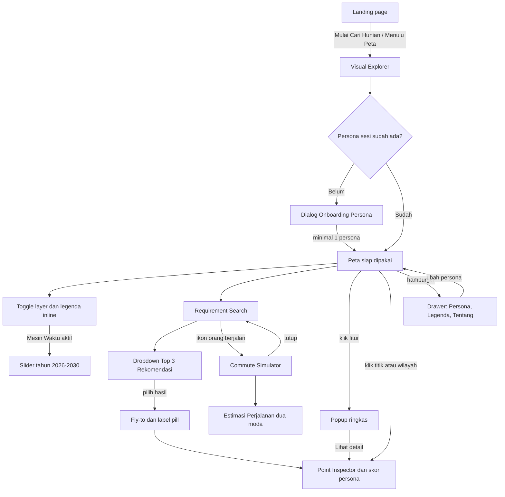
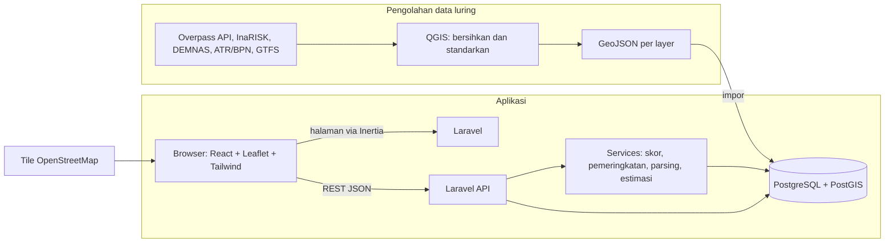

# PRD NalarRuang

## 0. Metadata Dokumen

| Butir | Isi |
|---|---|
| Judul | Product Requirements Document — NalarRuang |
| Versi | 1.0-draft |
| Tanggal | 27 September 2026 |
| Penyusun | Tim Kelompok 4 — Developer Rumah |
| Status | Draf untuk ditinjau tim dan Dosen Pengampu |

**Sumber dan kewenangan.**

| Sumber | Kewenangan |
|---|---|
| `docs/sumber/SRS.md` (SRS v1.0, 20 Sep 2026) | Cakupan, fungsi, aturan bisnis, data, batasan (tertinggi) |
| `docs/sumber/WBS.md` | Jadwal sprint, deliverable, acceptance criteria work package, PIC |
| `docs/sumber/CHARTER.md` | Latar belakang saja |
| `docs/sumber/DESKRIPSI.md` | Konteks historis dan rincian sumber data saja |
| Desain UI Sprint 0 (`docs/design/`, 12 screenshot; Figma `ui-nalar-ruang`) + `docs/design/analisis-uiux-nalarruang.md` | Tampilan, tata letak, alur layar, microcopy. Menjawab TBD-02. |
| `docs/RENCANA.md` | Keputusan teknis tim (stack); menang bila bertabrakan dengan prompt penyusunan |
| `design-system.md` | Nilai visual (token, komponen) |

**Kebijakan desain (ringkas).** (1) Gaya visual desain dilindungi dan diikuti persis. (2) Yang belum didesain ditulis lengkap di PRD dan diimprovisasi dengan meniru komponen desain yang ada; tidak ada langkah menunggu desain. (3) Masalah fungsi diselesaikan lewat perilaku, bukan perubahan tampilan. (4) Variasi komponen: versi yang muncul di lebih banyak layar dipakai.

| Versi | Tanggal | Perubahan |
|---|---|---|
| 1.0-draft | 27 Sep 2026 | Draf pertama dari SRS v1.0, WBS, dan desain Sprint 0 |

---

## 1. Ringkasan Eksekutif

NalarRuang adalah aplikasi WebGIS untuk mencari kawasan hunian ideal di Jabodetabek berdasarkan gaya hidup pengguna. Pengguna memilih satu atau lebih persona (Commuter, Driver, Social & Vibe, Zen), lalu menjelajah peta dengan enam layer data spasial, mencari kawasan dan mendapat tepat tiga rekomendasi, memeriksa sebuah titik atau wilayah untuk melihat skor 0–3 bintang per persona, dan mensimulasikan waktu tempuh ke kantor atau kampus (SRS 1.4, 2.3).

Pengguna adalah calon pencari hunian yang anonim, tanpa akun (SRS U01). Masalah yang diselesaikan: keputusan memilih kawasan masih bergantung pada iklan dan klaim agen, sementara data yang relevan dengan gaya hidup tiap orang tersebar dan sulit dibaca (SRS 2.1; Desain: landing-page.png, "Eksplorasi data, bukan cuma iklan.").

Di akhir semester (27 November 2026) tim menyerahkan aplikasi web yang ter-deploy dengan landing page dan Visual Explorer yang mencakup FR-01 s.d. FR-21, enam layer data dari data sekunder publik, dokumentasi pengguna dan teknis, serta hasil pengujian (WBS D4, D5).

---

## 2. Latar Belakang & Problem Statement

Proyek bermula dari asimetri informasi properti di Jabodetabek: risiko banjir, kriminalitas, dan polusi sering tidak terungkap dalam iklan hunian (Charter; SRS 2.1). Selama Sprint 0, nilai utama bergeser menjadi **personalisasi pencarian kawasan hunian ideal berdasarkan preferensi gaya hidup** (WBS B; SRS 1.4). Kawasan yang sama bisa ideal bagi pengguna KRL dan buruk bagi yang mengutamakan ketenangan; karena itu NalarRuang menilai kawasan per persona, bukan dengan satu skor umum.

**Problem statement.** Calon penghuni di Jabodetabek tidak punya cara cepat untuk membandingkan kawasan berdasarkan kebutuhan hariannya sendiri (akses transit, akses tol, tempat nongkrong, ketenangan) dengan data yang bisa ditelusuri, sehingga keputusan diambil dari iklan dan klaim subjektif. Pesan produk di landing: "Eksplorasi data, bukan cuma iklan." dan "Hunian yang cocok. Kota yang terbaca." (Desain: landing-page.png).

---

## 3. Tujuan, Non-Goals & Metrik Keberhasilan

**Tujuan.**
1. Pengguna dapat menemukan tiga kawasan yang paling sesuai kebutuhannya dari satu pencarian (FR-05, FR-06, BR-1).
2. Pengguna dapat menilai sebuah titik atau wilayah per persona dengan skor 0–3 bintang dan ringkasan (FR-09, FR-17).
3. Pengguna dapat membandingkan waktu tempuh dua moda dari calon hunian ke tempat aktivitas (FR-10, FR-11).
4. Semua fungsi FR-01 s.d. FR-21 berjalan di staging dan produksi pada 27 Nov 2026 (WBS D4, D5).

**Non-goals.** Aplikasi mobile native; listing atau transaksi properti; pengumpulan data primer (survei lapangan); analisis di luar Jabodetabek (SRS 1.4); akun dan login (SRS 2.4).

**Metrik keberhasilan.**

| Metrik | Target | Sumber |
|---|---|---|
| Requirement Search selalu mengembalikan tepat 3 rekomendasi | 100% pencarian yang berhasil | SRS BR-1 |
| Fungsi utama lulus test case | Seluruh test case; defect kritis nihil | WBS D5 |
| UAT | Diterima Dosen Pengampu | WBS D5, 1.5.2 |
| Setiap increment didemokan di staging | Sprint Review 1, 2, 3 | WBS D4, 1.4.7 |
| GeoJSON 6 layer lolos validasi dan terimpor ke PostGIS | Tanpa error | WBS D3 |
| Unit test kritis | Lulus sesuai target coverage `[TBD]` | WBS 1.5.2 |
| Waktu render peta dan respons API | `[TBD-06]` | SRS 5.1 |

---

## 4. Pengguna & Persona

**U01 — Pengguna Akhir.** Calon pencari hunian di Jabodetabek yang memakai semua fitur tanpa akun. Di awal sesi memilih minimal satu persona, boleh lebih (SRS 2.4).

| Persona | Mengutamakan | Faktor yang memengaruhi skor (WBS 1.4.5) | Layer terkait | Deskripsi di desain (dikutip) |
|---|---|---|---|---|
| Commuter | Akses transit | Akses transit dan trotoar | Mobilitas & Transit, Inklusivitas | "Mengutamakan akses transit, seperti stasiun dan halte." |
| Driver | Akses jalan/tol | Lebar jalan, jarak tol, SPBU | Mobilitas & Transit, Ekosistem Mikro | "Mengutamakan aksesjalan utama dan gerbang tol." |
| Social & Vibe | Hiburan, kafe, restoran | Rasio kafe/restoran/hiburan | Ekosistem Mikro & Gaya Hidup | "Mengutamakan hiburan, kafe, dan restoran." |
| Zen | Keamanan, minim polusi, RTH | Polusi suara, keamanan, banjir, RTH | Historis & Risiko, Ekosistem Mikro | "Mengutamakan keamanan, minim polusi, dan ruang terbuka hijau." |

(Desain: drawer-persona.png. Teks Driver dikutip apa adanya; lihat OQ-08.)

**Skenario (SRS 4).**
- Pengguna mencentang Commuter dan Zen di awal sesi; esok harinya di sesi baru dialog muncul lagi (FR-13, FR-14).
- Pengguna Commuter mengetik "Daerah mudah transum di Bogor Kota" dan mendapat Top 3; lalu mencarikan hunian untuk orang tuanya dengan mode checkbox: kota Depok, persona Zen saja (FR-05, FR-06, FR-15).
- Di titik dekat Stasiun Bogor, skor Commuter 3 bintang karena jaraknya kurang dari 500 m ke stasiun; di poligon Kota Bogor skor Commuter 1 bintang karena secara agregat hanya ada 2 stasiun (FR-09).
- Pengguna mengisi calon hunian dan kantor di Kuningan, lalu membandingkan waktu tempuh kendaraan pribadi dan transportasi publik (FR-10, FR-11).

---

## 5. Ruang Lingkup

| In Scope | Out of Scope |
|---|---|
| Visual Explorer: basemap, pan/zoom, highlight/dim, enam layer, slider Mesin Waktu (FR-01–04) | Aplikasi mobile native |
| Requirement Search: teks bebas, nama wilayah, mode checkbox, Top 3, fly-to, toggle Commute (FR-05–07, FR-15, FR-16) | Listing dan transaksi properti |
| Smart Point Inspector + Persona Grading 0–3 bintang + auto-summary (FR-08, FR-09, FR-17) | Survei lapangan / data primer |
| Commute Simulator: Pin A/B, jarak dan waktu dua moda (FR-10, FR-11) | Analisis di luar Jabodetabek |
| **Estimasi biaya per moda** — masuk cakupan mengikuti desain (D7, K2) | Akun, login, penyimpanan data pribadi |
| Onboarding persona sesi (FR-13, FR-14) | Data real-time berbayar dan scraping berita |
| Menu utama: preferensi persona, legenda, tentang (FR-18–21) | |
| **Landing page** — masuk cakupan sebagai fitur pendukung mengikuti desain (D8, K1) | |
| Backend & Spatial API (FR-12) | |
| Pipeline data offline QGIS → GeoJSON → PostGIS (WBS 1.3) | |

### Kandidat Pengembangan Lanjutan (di luar MVP)
- Fitur akun untuk menyimpan preferensi lintas sesi (perlu tinjauan UU PDP, SRS 6.3, TBD-07).
- Dukungan bahasa selain Indonesia (SRS 6.2).
- Tampilan untuk perangkat mobile.

---

## 6. Konsep Produk & Alur Pengguna

NalarRuang punya dua permukaan: **Landing page** (halaman pemasaran editorial) dan **Visual Explorer** (aplikasi peta). Visual Explorer adalah hub: dari satu halaman peta, pengguna bebas berpindah antara menjelajah layer, mencari, memeriksa lokasi, dan mensimulasikan perjalanan, tanpa urutan baku (SRS 4.7.3).

**Alur satu sesi.**
1. Pengguna membuka landing page, membaca nilai produk, lalu menekan "Mulai Cari Hunian", "Menuju Peta", atau "Buka Peta Interaktif".
2. Visual Explorer terbuka. Karena sesi belum punya persona, Dialog Onboarding Persona `[Improvisasi]` muncul di atas peta yang di-blur.
3. Pengguna mencentang minimal satu persona dan menekan "Mulai Jelajahi Peta".
4. Pengguna bebas: menyalakan layer, mencari lalu memilih salah satu Top 3 (fly-to lalu Point Inspector terbuka), mengeklik lokasi untuk melihat skor persona, atau beralih ke Commute Simulator.
5. Kapan saja pengguna membuka menu untuk mengubah persona, melihat legenda, atau membaca tentang aplikasi.
6. Menutup tab mengakhiri sesi; persona ditanyakan lagi di sesi berikutnya.

---

## 7. Kebutuhan Fungsional per Fitur

Sumber UI: **Desain** (sudah digambar), **Desain + Improvisasi** (sebagian digambar), **Improvisasi** (belum digambar, dibangun langsung meniru komponen desain). Semua arahan komponen merujuk nama komponen di `design-system.md`.

### 7.1 Visual Explorer (fitur inti)

**Deskripsi.** Peta interaktif layar penuh dengan enam layer yang dapat dinyalakan dan dimatikan sendiri-sendiri. Prioritas: Tinggi (FR-01–03), Sedang (FR-04) (SRS 4).

**Sumber UI.** FR-01 Desain · FR-02 Improvisasi · FR-03 Desain · FR-04 Desain. (Desain: top-3-rekomendasi.png, visual-explorer.png, layer-historis.png, layer-ekosistem.png, layer-inklusivitas.png, layer-mobilitas.png, layer-mesin-waktu.png, layer-legalitas.png)

**Deskripsi UI.**
- Peta Leaflet dengan tile OpenStreetMap standar selebar layar; atribusi "Leaflet | © OpenStreetMap" di kanan bawah; kontrol zoom Leaflet di kiri bawah.
- Tombol hamburger bulat di kiri atas.
- Panel kaca "Layer Peta" di sisi kanan berisi enam kartu berurutan: Historis & Risiko ("Area rawan banjir dan risiko lain."), Ekosistem Mikro & Gaya Hidup ("Kafe, restoran, dan ruang hijau."), Inklusivitas ("Aksesibilitas dan fasilitas umum."), Mobilitas & Transit ("Halte, stasiun, dan akses jalan."), Mesin Waktu ("Proyek infrastruktur per tahun."), Legalitas Lahan ("Gambaran status lahan kawasan."). Tiap kartu: ikon, nama, deskripsi, toggle.
- Kartu aktif menonjol (latar putih) dan menampilkan legenda inline: "Area Merah di Peta", "Titik Hijau di Peta", "Titik Biru di Peta", legenda Mobilitas (lihat BR-16), "Garis Putus-putus di Peta", "Area Ungu di Peta".
- Mesin Waktu aktif memunculkan slider tahun 2026–2030 dengan chip "Tahun 20xx" di bawah kartunya.
- Fitur layer diberi label pill bernama; klik fitur membuka popup kartu (judul + deskripsi + tombol tutup).
- Highlight/dim `[Improvisasi]`: meniru efek redup baris persona non-sesi; fitur di luar filter aktif diredupkan, fitur relevan tetap penuh; basemap tidak diubah.

**User stories dan acceptance criteria.**

**US-01** — Sebagai pengguna, saya ingin menggeser dan memperbesar peta Jabodetabek, sehingga saya bisa melihat kawasan yang saya minati. (FR-01; UC-02; UI01)
- Diberikan Visual Explorer terbuka, Ketika halaman selesai dimuat, Maka peta OpenStreetMap standar tampil layar penuh berpusat di Jabodetabek dengan kontrol zoom di kiri bawah dan atribusi di kanan bawah (tampilan sesuai top-3-rekomendasi.png).
- Diberikan peta tampil, Ketika pengguna menyeret peta atau memakai tombol +/− atau scroll, Maka peta bergeser dan berubah zoom tanpa memuat ulang halaman.
- Diberikan tile gagal dimuat, Ketika koneksi terputus, Maka kontrol aplikasi tetap tampil dan dapat dipakai kembali setelah koneksi pulih.

**US-02** — Sebagai pengguna, saya ingin menyalakan dan mematikan tiap layer, sehingga saya hanya melihat data yang relevan. (FR-03; UC-02; UI01)
- Diberikan semua layer mati, Ketika pengguna menyalakan toggle "Inklusivitas", Maka titik biru tampil di peta, kartu menjadi aktif, dan legenda inline "Titik Biru di Peta" muncul di kartu (tampilan sesuai layer-inklusivitas.png).
- Diberikan dua layer aktif, Ketika pengguna mematikan salah satunya, Maka hanya data layer itu yang hilang dan legenda inline kartunya tersembunyi.
- Diberikan enam layer aktif, Ketika semua legenda dan slider tampil, Maka panel Layer Peta tetap dalam layar dan isinya dapat di-scroll (tampilan sesuai visual-explorer.png).
- Edge: data layer gagal dimuat → kartu menampilkan "Layer gagal dimuat." dan tautan "Coba lagi", toggle dinonaktifkan, basemap tetap tampil (UC-02 Alternative Flow 1).

**US-03** — Sebagai pengguna, saya ingin area yang relevan disorot dan area lain diredupkan, sehingga fokus saya terjaga. (FR-02; UC-02 langkah 4) `[Improvisasi]`
- Diberikan Requirement Search menghasilkan Top 3, Ketika hasil tampil, Maka fitur layer di luar tiga kawasan hasil diredupkan dan fitur di dalamnya tampil penuh, tanpa mengubah basemap.
- Diberikan filter dihapus (dropdown ditutup atau search bar dikosongkan), Ketika itu terjadi, Maka semua fitur kembali ke tampilan normal.
- Pembaruan terjadi tanpa memuat ulang halaman; target waktu `[TBD-06]`.

**US-04** — Sebagai pengguna, saya ingin memilih tahun pada Mesin Waktu, sehingga saya melihat proyek infrastruktur tahun itu. (FR-04; BR-3; UC-02 langkah 5)
- Diberikan Mesin Waktu mati, Ketika pengguna menyalakannya, Maka slider "2026 … 2030" muncul tepat di bawah kartu Mesin Waktu (tampilan sesuai layer-mesin-waktu.png).
- Diberikan slider pada "Tahun 2029", Ketika pengguna menggeser ke 2027, Maka chip berubah menjadi "Tahun 2027" dan peta hanya menampilkan proyek tahun 2027.
- Edge: tidak ada proyek pada tahun terpilih → garis tidak tampil dan legenda tetap; kartu menampilkan "Belum ada proyek di tahun ini." `[Improvisasi, meniru legenda inline]`.

**US-05** — Sebagai pengguna, saya ingin mengeklik fitur di peta dan membaca penjelasannya, sehingga saya paham arti titik atau area itu. (FR-03, FR-08; UC-04)
- Diberikan layer Ekosistem aktif, Ketika pengguna mengeklik titik hijau, Maka popup kartu dengan judul fitur dan deskripsi dari data tampil (tampilan sesuai layer-ekosistem.png).
- Diberikan popup terbuka, Ketika pengguna mengeklik fitur lain, Maka popup lama tertutup dan hanya satu lokasi yang terpilih (BR-13).
- Diberikan popup akan tampil di dekat search bar atau panel layer, Ketika dibuka, Maka peta bergeser otomatis sehingga popup tidak menutupi kontrol (BR-15).

**Edge case & error.** Layer gagal dimuat (UC-02 AF1); tile gagal; semua layer aktif di layar pendek (panel scroll).

**Dependensi.** WBS 1.3 (GeoJSON 6 layer), 1.4.1, 1.4.3, 1.4.6.2. TBD-06, TBD-08, OQ-07.

### 7.2 Requirement Search (fitur inti)

**Deskripsi.** Satu search bar untuk teks bebas, nama wilayah, atau mode checkbox kota + persona, menghasilkan tepat tiga rekomendasi. Prioritas: Tinggi (FR-05, FR-06), Sedang (FR-07, FR-15, FR-16).

**Sumber UI.** FR-05 Desain · FR-06 Desain · FR-07 Improvisasi (keadaan sesudah fly-to) · FR-15 Improvisasi · FR-16 Desain. (Desain: top-3-rekomendasi.png)

**Deskripsi UI.**
- Search bar kaca melayang di tengah atas: ikon kaca pembesar di kiri, placeholder "Ketik 'Daerah asri di Bogor'...", tombol toggle bergambar orang berjalan di kanan.
- Hasil berupa dropdown yang menyatu di bawah search bar berjudul "TOP 3 REKOMENDASI": tiga baris, masing-masing ikon bintang kuning, nama kawasan + kota, dan satu kalimat alasan.
- Mode checkbox `[Improvisasi]`: panel di bawah search bar bergaya dropdown Top 3, berisi label "PILIH KOTA", pilihan kota berupa tab pill, label "PERSONA" dengan kartu checkbox persona ringkas (meniru Kartu Checkbox Persona drawer), dan tautan "Pakai persona sesi".
- Sesudah fly-to `[Improvisasi]`: marker lokasi memakai ikon pin tempat Point Inspector + label pill nama kawasan (meniru label pill peta), lalu Point Inspector terbuka.

**US-06** — Sebagai pengguna, saya ingin mengetik kebutuhan atau nama wilayah, sehingga saya tidak perlu tahu nama kawasan terlebih dulu. (FR-05; UC-03; UI02)
- Diberikan search bar kosong, Ketika pengguna mengetik "Daerah mudah transum di Bogor Kota" dan menekan Enter, Maka sistem memproses pencarian dan menampilkan dropdown "TOP 3 REKOMENDASI".
- Diberikan pengguna mengetik "Kecamatan Cibubur", Ketika Enter, Maka hasil dibatasi pada wilayah itu.
- Cara menafsirkan teks bebas mengikuti keputusan TBD-11.

**US-07** — Sebagai pengguna, saya ingin melihat tepat tiga rekomendasi dengan alasannya, sehingga saya bisa langsung membandingkan. (FR-06; BR-1; UC-03)
- Diberikan pencarian berhasil, Ketika hasil tampil, Maka dropdown berisi tepat tiga baris berurutan sesuai peringkat, masing-masing nama kawasan + kota dan satu kalimat alasan (tampilan sesuai top-3-rekomendasi.png).
- Diberikan persona sesi Commuter, Ketika hasil dihitung, Maka peringkat memakai persona sesi sebagai bobot bawaan (SRS 4, skenario onboarding).
- Edge: tidak ada lokasi yang cocok → dropdown menampilkan "Belum ada kawasan yang cocok" dan "Coba longgarkan kata kunci atau pilih kota lain." (UC-03 AF1) `[Improvisasi]`.
- Edge: kawasan yang memenuhi kurang dari tiga → sistem tetap menampilkan tepat tiga dengan mengisi sisanya dari kawasan terdekat berikutnya menurut skor, atau menampilkan keadaan kosong bila tidak ada sama sekali (BR-1; OQ-04).

**US-08** — Sebagai pengguna, saya ingin peta terbang ke rekomendasi yang saya pilih, sehingga saya langsung melihat lokasinya. (FR-07; UC-03 langkah 6–7)
- Diberikan dropdown Top 3 tampil, Ketika pengguna memilih baris kedua, Maka dropdown tertutup, kamera beranimasi (fly-to) ke kawasan itu, label pill nama kawasan tampil, dan Point Inspector terbuka untuk kawasan itu.
- Diberikan preferensi "kurangi gerakan" aktif di sistem operasi, Ketika memilih hasil, Maka peta berpindah tanpa animasi.

**US-09** — Sebagai pengguna, saya ingin memilih kota dan persona untuk satu pencarian, sehingga saya bisa mencarikan hunian untuk orang lain. (FR-15; BR-12; UC-03 AF2) `[Improvisasi]`
- Diberikan persona sesi Commuter, Ketika pengguna membuka mode checkbox, memilih "Depok", mencentang hanya "Zen", lalu mencari, Maka hasil dihitung untuk Zen di Depok.
- Diberikan pencarian tersebut selesai, Ketika pengguna membuka drawer tab Persona, Maka persona sesi tetap Commuter (BR-12).
- Diberikan pengguna menekan "Pakai persona sesi", Ketika itu terjadi, Maka centang persona diisi sesuai persona sesi.
- Edge: sesi tanpa persona (lihat OQ-01) → mode checkbox dibuka tanpa centang bawaan (UC-03 AF2).

**US-10** — Sebagai pengguna, saya ingin beralih dari pencarian ke simulasi perjalanan dari search bar yang sama, sehingga alurnya seperti Google Maps. (FR-16; UC-03 AF3; UI02)
- Diberikan search bar tampil, Ketika pengguna menekan ikon orang berjalan, Maka search bar berganti menjadi kartu "Commute Simulator" di posisi yang sama.
- Diberikan kartu Commute tampil, Ketika pengguna menekan tombol tutup, Maka search bar kembali.

**Dependensi.** WBS 1.4.2, 1.4.6.2, 1.2.3 (rancangan algoritma). TBD-05, TBD-11, OQ-04.

### 7.3 Smart Point Inspector + Persona Grading (fitur inti)

**Deskripsi.** Panel "Detail Lokasi" yang muncul saat titik atau poligon diklik, berisi skor 0–3 bintang untuk empat persona dan ringkasan untuk tiap persona sesi. Prioritas: Tinggi (FR-08, FR-09), Sedang (FR-17).

**Sumber UI.** FR-08 Desain + Improvisasi · FR-09 Desain + Improvisasi · FR-17 Desain + Improvisasi. (Desain: visual-explorer.png, point-inspector.png, layer-*.png)

**Deskripsi UI.**
- Panel kaca setinggi layar di sisi kiri berjudul "Detail Lokasi" dengan tombol tutup di kanan atas panel (D3).
- Blok tempat: ikon pin, label "AREA TERPILIH", nama lokasi, alamat/kelurahan.
- "Kecocokan Gaya Hidup": empat baris persona (ikon, nama, tiga bintang). Persona sesi disorot dan diberi badge "PROFIL ANDA"; persona lain tampil redup.
- Kartu "KESIMPULAN SINGKAT" berisi kalimat seperti "Buat gaya hidup Commuter: Sangat mendukung aktivitasmu!".
- `[Improvisasi]` Varian titik memakai label "TITIK TERPILIH" dengan gaya label yang sama; varian wilayah tetap "AREA TERPILIH" (meniru konsep TITIK / WILAYAH di demo landing).
- `[Improvisasi]` Ringkasan data layer di lokasi: baris legenda inline per layer yang punya data di lokasi itu, di antara skor dan kesimpulan.
- `[Improvisasi]` Beberapa persona sesi: setiap persona sesi mendapat baris sorot + badge "PROFIL ANDA" dan kalimat sendiri di kartu kesimpulan yang sama.
- `[Improvisasi]` Skor 0: tiga bintang kosong dan teks kecil "0 dari 3".

**Aturan Persona Grading (SRS 4; BR-9, BR-10; WBS 1.4.5).**
- Skala: 0 = tidak ada/buruk, 1 = sekadar ada, 2 = bagus, 3 = sangat bagus.
- **Titik**: berbasis radius jarak ke fasilitas relevan; semakin dekat semakin tinggi. Acuan bintang 3: ±500–600 m jalan kaki (5-minute city) dan 1–2 km berkendara. Ambang bintang 0–2 `[TBD-10]`.
- **Wilayah (poligon)**: berbasis jumlah fasilitas dalam area; ambang tiap tingkat `[TBD-09]`.
- Faktor per persona mengikuti tabel bagian 4; bobot `[TBD-05]` dan dapat disesuaikan (BR-2).
- Auto-summary hanya untuk persona sesi (BR-11), kalimat mengikuti pola desain "Buat gaya hidup [Persona]: [frasa]" dengan frasa per skor: 3 "Sangat mendukung aktivitasmu!" (desain), 2 "Cukup mendukung aktivitasmu.", 1 "Kurang mendukung aktivitasmu.", 0 "Belum mendukung aktivitasmu." `[Improvisasi]`.
- Skor di screenshot desain adalah data contoh; aplikasi menampilkan hasil perhitungan (BR-18).

**US-11** — Sebagai pengguna, saya ingin membuka detail lokasi dengan mengeklik peta dan menutupnya lagi, sehingga saya bisa memeriksa banyak lokasi. (FR-08; UC-04; UI03)
- Diberikan peta tampil, Ketika pengguna mengeklik sebuah poligon, Maka panel "Detail Lokasi" muncul di kiri dengan label "AREA TERPILIH", nama, dan alamat (tampilan sesuai visual-explorer.png).
- Diberikan panel terbuka, Ketika pengguna menekan tombol tutup di kanan atas panel atau Esc, Maka panel tertutup dan fokus kembali ke lokasi di peta.
- Diberikan panel terbuka, Ketika pengguna mengeklik lokasi lain, Maka isi panel berganti ke lokasi baru; tidak ada panel kedua (BR-13).
- Diberikan panel terbuka, Maka tombol hamburger dan kontrol zoom tetap terlihat dan dapat diklik (BR-15).
- Edge: lokasi tanpa data pada layer aktif → notifikasi "Data belum tersedia di sini" dengan teks "Layer ini belum punya data untuk lokasi yang kamu pilih." (UC-04 AF1) `[Improvisasi]`.

**US-12** — Sebagai pengguna, saya ingin melihat skor keempat persona di satu lokasi, sehingga saya tahu lokasi itu cocok untuk gaya hidup apa. (FR-09; BR-9; UC-05)
- Diberikan panel terbuka, Maka "Kecocokan Gaya Hidup" menampilkan empat baris Commuter, Driver, Social & Vibe, Zen, masing-masing 0–3 bintang hasil perhitungan.
- Diberikan pembaca layar aktif, Ketika fokus pada baris Commuter bernilai 3, Maka dibacakan "Commuter, 3 dari 3 bintang".
- Diberikan skor 0, Maka baris menampilkan tiga bintang kosong dan "0 dari 3".

**US-13** — Sebagai pengguna, saya ingin tahu apakah yang saya pilih titik atau wilayah, sehingga saya paham cara skornya dihitung. (FR-09; BR-10) `[Improvisasi]`
- Diberikan pengguna mengeklik titik, Maka label berbunyi "TITIK TERPILIH" dan skor dihitung dengan metode radius.
- Diberikan pengguna mengeklik poligon, Maka label berbunyi "AREA TERPILIH" dan skor dihitung dengan metode kuantitas.
- Diberikan titik dekat Stasiun Bogor (< 500 m), Maka skor Commuter 3 bintang (SRS skenario FR-09).

**US-14** — Sebagai pengguna dengan beberapa persona, saya ingin ringkasan untuk tiap persona saya, sehingga saya tidak perlu menafsirkan bintang sendiri. (FR-17; BR-11; FR-14)
- Diberikan persona sesi Commuter dan Zen, Ketika panel dibuka, Maka baris Commuter dan Zen sama-sama disorot dengan badge "PROFIL ANDA", baris Driver dan Social & Vibe redup, dan kartu "KESIMPULAN SINGKAT" berisi dua kalimat: satu untuk Commuter, satu untuk Zen.
- Diberikan persona sesi hanya Social & Vibe dengan skor 3, Maka kesimpulan berbunyi "Buat gaya hidup Social & Vibe: Sangat mendukung aktivitasmu!" (tampilan sesuai visual-explorer.png).
- Diberikan pengguna mengubah persona di drawer, Ketika panel masih terbuka, Maka badge dan kalimat langsung menyesuaikan tanpa memuat ulang.

**US-15** — Sebagai pengguna, saya ingin tahu bila data di lokasi tidak lengkap, sehingga saya tidak salah menilai skor. (UC-05 AF1) `[Improvisasi]`
- Diberikan salah satu layer pendukung skor tidak punya data di lokasi, Maka skor tetap tampil dan kartu kesimpulan menambahkan "Sebagian data di lokasi ini belum lengkap, jadi skornya bisa berubah."

**Dependensi.** WBS 1.4.4, 1.4.5, 1.4.6.2. TBD-05, TBD-09, TBD-10.

### 7.4 Commute Simulator (fitur inti)

**Deskripsi.** Estimasi jarak, waktu tempuh, dan biaya antara calon hunian (Pin A) dan tujuan (Pin B) untuk transportasi publik dan kendaraan pribadi. Prioritas: Sedang (FR-10, FR-11); biaya: Sedang (disarankan).

**Sumber UI.** FR-10 Desain + Improvisasi · FR-11 Desain. (Desain: commute-simulator.png)

**Deskripsi UI.**
- Kartu kaca "Commute Simulator" di tengah atas menggantikan search bar: baris "LOKASI RUMAH" (pin cyan) dan "LOKASI TUJUAN" (pin oranye), tombol "Reset & Pilih Ulang", tombol tutup.
- Peta menampilkan marker "Lokasi Rumah" dan "Lokasi Tujuan" dengan label pill dan garis rute putus-putus.
- Kartu "Estimasi Perjalanan" di kiri bawah: chip jarak, dua opsi moda ("Trans. Publik", "Mobil Pribadi"), masing-masing waktu, biaya, dan keterangan sumber.
- `[Improvisasi]` Keadaan kosong dan mengisi: baris memakai input teks dengan placeholder "Ketik alamat atau pilih di peta" dan tautan "Pilih di peta"; tombol reset nonaktif sampai ada isian (meniru baris LOKASI RUMAH/TUJUAN).

**US-16** — Sebagai pengguna, saya ingin menentukan titik rumah dan tujuan lewat teks atau klik peta, sehingga saya bisa memakai cara yang paling mudah. (FR-10; UC-06; UI04)
- Diberikan kartu Commute kosong, Ketika pengguna mengetik alamat di "LOKASI RUMAH" dan memilih salah satu saran, Maka marker "Lokasi Rumah" tampil di peta.
- Diberikan kartu Commute kosong, Ketika pengguna menekan "Pilih di peta" pada "LOKASI TUJUAN" lalu mengeklik peta, Maka marker "Lokasi Tujuan" tampil dan baris terisi nama tempat.
- Diberikan kedua titik terisi, Ketika pengguna menekan "Reset & Pilih Ulang", Maka kedua baris kosong, marker dan rute hilang.
- Diberikan Point Inspector terbuka untuk suatu lokasi, Ketika pengguna beralih ke Commute, Maka lokasi itu terisi otomatis sebagai "LOKASI RUMAH" `[Improvisasi]`.

**US-17** — Sebagai pengguna, saya ingin membandingkan waktu tempuh dua moda, sehingga saya tahu trade-off mobilitas. (FR-11; UC-06)
- Diberikan kedua titik terisi, Maka rute putus-putus tampil dan kartu "Estimasi Perjalanan" muncul di kiri bawah dengan chip jarak serta dua opsi: "Trans. Publik" dan "Mobil Pribadi", masing-masing waktu tempuh (tampilan sesuai commute-simulator.png).
- Diberikan pengguna memilih opsi "Mobil Pribadi", Maka opsi itu disorot dan rute di peta mengikuti moda tersebut.
- Diberikan kartu Estimasi tampil, Maka kontrol zoom tetap terlihat dan dapat diklik (BR-15).
- Edge: rute satu moda tidak ditemukan → opsi moda itu menampilkan "Tidak tersedia" dan "Coba titik yang lebih dekat ke jalan"; moda lain tetap tampil (UC-06 AF1) `[Improvisasi]`.

**US-18** — Sebagai pengguna, saya ingin melihat perkiraan biaya tiap moda beserta sumbernya, sehingga saya bisa menimbang ongkos harian. (D7, K2)
- Diberikan estimasi tampil, Maka tiap opsi moda menampilkan biaya dalam Rupiah dan keterangan sumber yang sesuai data rute itu (mis. "Berdasarkan tarif resmi KRL" hanya bila rute memakai KRL) (BR-16).
- Edge: biaya tidak tersedia untuk suatu moda → teks biaya diganti "Biaya tidak tersedia" `[Improvisasi]`.
- Sumber data waktu tempuh dan biaya: OQ-02, OQ-03 (TBD-ROUTE).

**Dependensi.** WBS 1.4.5. TBD-ROUTE (OQ-02), OQ-03.

### 7.5 Onboarding Persona (fitur pendukung)

**Deskripsi.** Dialog pemilihan persona di awal setiap sesi. Prioritas: Tinggi (FR-13, FR-14).

**Sumber UI.** FR-13 Improvisasi · FR-14 Desain + Improvisasi (badge dan drawer sudah didesain; penyimpanan sesi adalah perilaku).

**Deskripsi UI `[Improvisasi]`.** Meniru drawer tab Persona (drawer-persona.png): panel dialog di tengah layar dengan latar dan kepala sama seperti drawer ("NalarRuang", tombol tutup kanan atas), peta di belakang di-blur. Judul "Pilih Persona Kamu", teks "Pilih satu atau lebih persona yang mewakili keseharianmu. Kamu bisa mengubahnya kapan saja lewat menu.", empat kartu checkbox persona dengan deskripsi desain, tombol "Mulai Jelajahi Peta".

**US-19** — Sebagai pengguna baru di sesi ini, saya ingin memilih persona sebelum menjelajah, sehingga hasil disesuaikan dengan gaya hidup saya. (FR-13; BR-7; UC-01; UI00)
- Diberikan sesi baru tanpa persona, Ketika Visual Explorer terbuka, Maka dialog onboarding tampil di atas peta yang di-blur dengan empat kartu persona beserta deskripsinya.
- Diberikan tidak ada kartu dicentang, Maka tombol "Mulai Jelajahi Peta" nonaktif.
- Diberikan pengguna menekan tombol tutup atau Esc tanpa memilih, Maka dialog tetap terbuka dan menampilkan peringatan "Pilih minimal satu persona dulu, ya." (BR-7; UC-01 AF1; lihat OQ-01 untuk UC-01 AF2).
- Diberikan pengguna mencentang Commuter dan Zen lalu menekan tombol, Maka dialog tertutup dan kedua persona menjadi persona sesi.

**US-20** — Sebagai pengguna, saya ingin preferensi persona hanya berlaku di sesi ini, sehingga tidak ada data saya yang tersimpan permanen. (FR-14; BR-6; SRS 5.2)
- Diberikan persona sesi tersimpan, Ketika pengguna berpindah antarfitur atau memuat ulang tab yang sama, Maka persona tetap berlaku.
- Diberikan pengguna menutup tab lalu membuka NalarRuang lagi, Maka dialog onboarding muncul kembali.
- Persona tidak pernah dikirim untuk disimpan di server dan tidak disimpan di cookie jangka panjang; hanya dikirim sebagai parameter permintaan pencarian dan skor.

**Dependensi.** Tidak ada ke backend. OQ-01.

### 7.6 Menu Utama (fitur pendukung)

**Deskripsi.** Drawer dari kiri dengan tab Persona, Legenda, Tentang. Prioritas: Sedang (FR-18, FR-19), Rendah (FR-20, FR-21).

**Sumber UI.** FR-18 Desain · FR-19 Desain · FR-20 Improvisasi · FR-21 Improvisasi. (Desain: drawer-persona.png)

**Deskripsi UI.** Drawer modal di kiri, peta di-blur; judul "NalarRuang" dan tombol tutup; tab "Persona", "Legenda", "Tentang". Tab Persona: "Ubah Preferensi Persona", "Pilih persona yang mewakili keseharianmu. Ini akan mengubah rekomendasi di peta secara instan.", empat kartu checkbox persona. `[Improvisasi]` Tab Legenda meniru legenda inline kartu layer; tab Tentang memakai teks landing (visi, sumber data, disclaimer).

**US-21** — Sebagai pengguna, saya ingin membuka menu dari peta, sehingga pengaturan dan penjelasan mudah dijangkau. (FR-18; UC-07; UI05)
- Diberikan Visual Explorer, Ketika pengguna menekan tombol hamburger, Maka drawer terbuka dari kiri dengan tab "Persona" terpilih dan peta di belakang di-blur (tampilan sesuai drawer-persona.png).
- Diberikan drawer terbuka, Ketika pengguna menekan tombol tutup, Esc, atau area peta yang di-blur, Maka drawer tertutup dan fokus kembali ke tombol hamburger.

**US-22** — Sebagai pengguna, saya ingin mengubah persona kapan saja tanpa memuat ulang, sehingga saya bisa membandingkan hasil. (FR-19; BR-8; UC-07)
- Diberikan persona sesi Driver, Ketika pengguna mencentang "Zen" di tab Persona, Maka persona sesi menjadi Driver dan Zen, dan badge, kesimpulan, serta hasil Top 3 yang terbuka diperbarui tanpa memuat ulang.
- Diberikan hanya satu persona tercentang, Ketika pengguna mencoba menghapus centangnya, Maka centang tetap dan peringatan "Pilih minimal satu persona dulu, ya." tampil (BR-7).
- Edge: perubahan gagal disimpan → toast "Gagal menyimpan preferensi. Coba pilih lagi." dan preferensi sebelumnya dipertahankan (UC-07 AF1) `[Improvisasi]`.

**US-23** — Sebagai pengguna baru, saya ingin membaca arti simbol dan istilah, sehingga saya paham peta. (FR-20; UC-07) `[Improvisasi]`
- Diberikan tab "Legenda" dipilih, Maka tampil satu baris per layer (simbol + nama + teks legenda), rincian jalur Mobilitas (KRL Bogor Line, KRL Rangkasbitung Line, KRL Cikarang Line, LRT Jabodebek, MRT, stasiun), dan daftar istilah (Persona, Skor bintang, Titik vs Wilayah, Fly-to, Basemap, Isochrone).

**US-24** — Sebagai pengguna, saya ingin membaca informasi umum aplikasi, sehingga saya tahu asal data dan batasannya. (FR-21; UC-07) `[Improvisasi]`
- Diberikan tab "Tentang" dipilih, Maka tampil deskripsi NalarRuang, sumber data terbuka (OpenStreetMap, Overpass API, InaRISK, ATR/BPN), dan disclaimer "Skor dan rekomendasi merupakan estimasi dari data sekunder publik."

**Dependensi.** FR-13, FR-14.

### 7.7 Landing Page (fitur pendukung)

**Deskripsi.** Halaman pemasaran editorial yang menjelaskan produk dan mengarahkan ke peta. Prioritas yang disarankan: Rendah. Masuk cakupan mengikuti desain (D8, K1).

**Sumber UI.** Desain (landing-page.png). Tidak ada FR SRS; lihat Lampiran B.

**Deskripsi UI.** Header (MENU, logo NalarRuang, "Menuju Peta"); hero "Hunian yang cocok. Kota yang terbaca." dengan eyebrow "Data Spasial × Persona × Rekomendasi"; marquee nama fitur; seksi visi (Spasial, Persona, Rekomendasi); "The Vision"; "Empat Cara Memandang Suatu Kota." (kartu foto 4 persona, "Pilihanmu dapat beririsan"); "Tiga cara menjelajah." (Requirement Search, Smart Point Inspector, Commute Simulator); "Enam layer, satu kota."; "Sumber Data Terbuka" dengan "Buka Peta Interaktif"; "Cara Kerja" (Kumpulkan, Olah, Hitung, Tampilkan); demo profil area Blok M dengan tab TITIK / WILAYAH; FAQ; CTA "Siap membaca kotamu sendiri?" dengan "Mulai Cari Hunian"; footer dengan disclaimer.

**US-25** — Sebagai calon pengguna, saya ingin memahami apa itu NalarRuang sebelum membuka peta, sehingga saya tahu manfaatnya. (D8)
- Diberikan pengguna membuka URL utama, Maka landing page tampil dengan seluruh seksi sesuai landing-page.png.
- Diberikan pengguna menekan "Mulai Cari Hunian", "Menuju Peta", atau "Buka Peta Interaktif", Maka Visual Explorer terbuka.
- Diberikan demo profil area, Ketika pengguna memilih tab "WILAYAH", Maka skor demo berganti ke contoh metode wilayah `[Improvisasi]`.

**US-26** — Sebagai calon pengguna, saya ingin jawaban atas pertanyaan umum, sehingga saya percaya pada datanya. (SRS 5.2, B07)
- Diberikan FAQ, Ketika pengguna membuka "Datanya dari mana?", Maka jawaban "NalarRuang memakai data sekunder publik dari OpenStreetMap, Overpass API, InaRISK, dan ATR/BPN." tampil; hanya satu item terbuka pada satu waktu.
- Jawaban lain sesuai SRS: tanpa login; persona hanya tersimpan selama sesi di browser; skor adalah estimasi dari data sekunder publik; cakupan Jabodetabek.
- Footer selalu menampilkan "Skor dan rekomendasi merupakan estimasi dari data sekunder publik."

**Dependensi.** Tidak ada ke backend. OQ-09 (domain/email).

### 7.8 Backend & Spatial API (fitur pendukung)

**Deskripsi.** RESTful API JSON untuk data layer, Requirement Search, skor persona, dan commute. Prioritas: Tinggi (FR-12).

**Sumber UI.** Tidak berlaku (non-UI).

**US-27** — Sebagai tim frontend, saya ingin endpoint JSON yang stabil, sehingga fitur peta bisa dibangun paralel. (FR-12; COM02; WBS 1.4.6.2)
- Diberikan layer aktif dan batas tampilan peta, Ketika frontend meminta data layer, Maka API mengembalikan GeoJSON yang difilter sesuai bounding box (SRS 4, skenario Backend).
- Diberikan parameter pencarian dan persona, Ketika frontend meminta Requirement Search, Maka API mengembalikan tepat tiga hasil berperingkat beserta alasan dan geometri (BR-1).
- Diberikan sebuah lokasi dan persona sesi, Ketika frontend meminta skor, Maka API mengembalikan jenis geometri, skor 0–3 untuk empat persona, status kelengkapan data, dan ringkasan layer.
- Diberikan Pin A dan Pin B, Ketika frontend meminta estimasi, Maka API mengembalikan jarak, serta waktu, biaya, dan keterangan sumber per moda atau status "tidak tersedia".
- Semua endpoint lulus uji fungsional dasar sesuai kontrak API (WBS 1.4.6.2); kontrak dibekukan setelah disepakati (`docs/SISTEM.md` bagian 2).

**Dependensi.** WBS 1.2.2, 1.2.3, 1.3.2, 1.4.6.1. TBD-04, TBD-06.

---

## 8. Business Rules

| ID | Aturan | Rujukan |
|---|---|---|
| BR-1 | Setiap hasil Requirement Search menampilkan tepat 3 rekomendasi. | SRS 5.6; FR-06 |
| BR-2 | Bobot skor persona dapat disesuaikan setelah uji coba data nyata. | FR-09; TBD-05 |
| BR-3 | Layer Mesin Waktu hanya menampilkan proyek sesuai tahun di slider. | FR-04 |
| BR-4 | Hanya data sekunder publik; tanpa data primer. | B07 |
| BR-5 | Analisis dan rekomendasi terbatas pada Jabodetabek. | B05 |
| BR-6 | Preferensi persona berbasis sesi; ditanyakan ulang di sesi baru. | FR-14 |
| BR-7 | Minimal satu persona wajib dicentang pada onboarding; boleh lebih. | FR-13 |
| BR-8 | Persona dapat diubah kapan saja lewat menu tanpa onboarding ulang atau reload. | FR-19 |
| BR-9 | Skor memakai skala 0–3 bintang. | FR-09 |
| BR-10 | Metode skor: radius untuk titik, kuantitas untuk poligon. | FR-09 |
| BR-11 | Auto-summary hanya untuk persona sesi. | FR-17 |
| BR-12 | Pilihan kota dan persona di mode checkbox hanya berlaku untuk pencarian itu. | FR-15 |
| BR-13 | Hanya satu lokasi terpilih pada satu waktu; popup dan Point Inspector selalu merujuk lokasi yang sama. | Analisis desain 7.2 |
| BR-14 | Setiap persona sesi mendapat baris sorot, badge "PROFIL ANDA", dan kalimat kesimpulan sendiri dengan komponen yang sama. | D6; FR-14, FR-17 |
| BR-15 | Tombol hamburger, search bar, dan kontrol zoom selalu terlihat dan dapat diklik saat panel, kartu, popup, atau drawer terbuka (drawer/dialog modal dikecualikan selama terbuka). | Analisis desain 7.1 |
| BR-16 | Teks legenda dan keterangan sumber mengikuti data yang benar-benar ditampilkan; warna tetap sesuai desain. | Analisis desain 7.2, 7.3 |
| BR-17 | Disclaimer estimasi dari landing juga tersedia di aplikasi (tab Tentang). | Analisis desain 4 |
| BR-18 | Skor, waktu, jarak, dan biaya di screenshot adalah contoh; aplikasi menampilkan hasil perhitungan. | Analisis desain 7.2 |

BR-13 s.d. BR-18 berasal dari analisis desain.

---

## 9. Data & Layer Spasial

| Layer | Isi data | Sumber sekunder (WBS 1.1.3, 1.3.1; Deskripsi) | Geometri | Representasi di desain | Dipakai oleh | Keterbatasan |
|---|---|---|---|---|---|---|
| Historis & Risiko | Banjir, elevasi, riwayat lahan, kriminalitas, AQI, kebisingan | InaRISK (BNPB), PetaBencana.id, DEMNAS (BIG), citra historis, data kriminalitas publik sekunder, ISPU/AQI, buffer kebisingan dari jaringan OSM | Poligon (utama), titik | "Area Merah di Peta"; popup "Area Banjir Tinggi" | Visual Explorer, skor Zen, Search | Kriminalitas dan AQI publik terbatas per wilayah |
| Ekosistem Mikro & Gaya Hidup | POI kafe, restoran, hiburan, RTH, UMKM, olahraga | Overpass API (OSM) | Titik, poligon RTH | "Titik Hijau di Peta" | Skor Social & Vibe, Zen, Driver (SPBU); Search | Kelengkapan POI OSM bervariasi |
| Inklusivitas | Fasilitas ramah disabilitas (ramp, guiding block, wheelchair) | Tag OSM `wheelchair=yes`, `tactile_paving=yes` | Titik | "Titik Biru di Peta" | Visual Explorer, skor Commuter (trotoar) | Data tipis; tanpa survei lapangan (B07) |
| Mobilitas & Transit | Stasiun, halte, jalur KRL/MRT/LRT/TransJakarta, jaringan jalan, isochrone | OSM/Overpass, GTFS BPTJ/TransJakarta bila tersedia | Titik, garis | Jalur berwarna per lintasan, stasiun lingkaran putih | Skor Commuter, Driver; Commute; Search | GTFS resmi belum pasti tersedia |
| Mesin Waktu | Proyek infrastruktur per tahun 2026–2030 | Dokumen rencana pemerintah terbuka, RDTR | Garis, poligon | "Garis Putus-putus di Peta"; slider "Tahun 20xx" | Visual Explorer | Tahun proyek perlu dikurasi manual |
| Legalitas Lahan | Status/peruntukan lahan | ATR/BPN (BHUMI), Jakarta Open Data/RDTR | Poligon | "Area Ungu di Peta"; label "Zona Perkantoran" | Visual Explorer | Jenis data (persil atau zonasi) = OQ-07 |

**Pipeline (WBS 1.3; SRS SW03).** Akuisisi di QGIS dan Overpass API (luring) → pembersihan dan standardisasi atribut → ekspor GeoJSON per layer → validasi skema dan geometri → impor ke PostgreSQL + PostGIS. Aplikasi hanya membaca hasilnya. Skema tabel tidak dirancang di PRD (TBD-04).

**Kebutuhan data tambahan dari desain.** Biaya perjalanan per moda (D7; OQ-03); tahun proyek Mesin Waktu 2026–2030 (FR-04); keterangan sumber per rute (BR-16); nama tempat untuk label pill dan alamat Point Inspector.

**Catatan.** Skor, waktu, jarak, dan biaya di screenshot adalah data contoh (BR-18).

---

## 10. Kebutuhan Non-Fungsional

| ID | Kategori | Kebutuhan | Sumber |
|---|---|---|---|
| NFR-01 | Kinerja | Peta multi-layer dan highlight/dim diperbarui tanpa jeda yang mengganggu; target waktu render `[TBD-06]`. | SRS 5.1 |
| NFR-02 | Kinerja | Endpoint layer memakai filter bounding box dan indeks spasial; waktu respons `[TBD-06]`. | SRS 5.1; WBS 1.4.6.3 |
| NFR-03 | Kinerja | Titik padat di-cluster dan layer dimuat saat dinyalakan (lazy load). | WBS 1.4.1 |
| NFR-04 | Privasi | Tidak ada akun dan tidak ada data pribadi yang disimpan. | SRS 5.2, 6.3 |
| NFR-05 | Privasi | Preferensi persona hanya di sisi klien per sesi; tidak dipersist ke basis data atau cookie jangka panjang. | SRS 5.2; BR-6 |
| NFR-06 | Keamanan | Komunikasi klien–server melalui HTTPS. | COM01 |
| NFR-07 | Keamanan | Kredensial dan kunci layanan hanya di konfigurasi lingkungan, tidak di repositori. | CLAUDE.md |
| NFR-08 | Keandalan | Staging dan produksi dapat diakses selama pengujian dan Sprint Review. | SRS 5.3; D03 |
| NFR-09 | Keandalan | Perhitungan spasial akurat dan konsisten terhadap data PostGIS; input yang sama menghasilkan skor yang sama. | SRS 5.3 |
| NFR-10 | Kemudahan penggunaan | Pengguna target dapat memakai fitur utama tanpa pelatihan. | SRS 5.4 |
| NFR-11 | Aksesibilitas perilaku | Panel, drawer, dialog, dropdown, toggle, dan slider dapat dioperasikan dengan keyboard; fokus terlihat; drawer/dialog mengunci fokus dan mengembalikannya ke pemicu; kontrol ikon punya label pembaca layar; skor dibacakan sebagai angka ("3 dari 3"); animasi dimatikan saat pengguna memilih kurangi gerakan. Tanpa mengubah gaya visual. | Kebijakan desain |
| NFR-12 | Kejujuran data | Disclaimer estimasi tersedia di landing dan aplikasi; keterangan sumber sesuai data. | BR-16, BR-17 |
| NFR-13 | Fidelitas desain | Layar yang sudah didesain diimplementasikan sesuai screenshot dan `design-system.md`; layar improvisasi hanya memakai token dan komponen design system. | Kebijakan desain |
| NFR-14 | Pemeliharaan | Kode dipisah per modul: Core Map, Requirement Search, Multi-Layer Mapping, Point Inspector, Persona Grading, Commute Simulator, Backend & API; logika skor, pemeringkatan, parsing, dan estimasi dapat diuji tanpa HTTP. | SRS 5.5; CLAUDE.md |
| NFR-15 | Lingkungan | Browser desktop Chrome, Firefox, Edge terbaru; server Linux. | SRS 2.5, SW04 |
| NFR-16 | Bahasa | Seluruh antarmuka Bahasa Indonesia sesuai microcopy desain; nama fitur boleh tetap Inggris sebagai nama produk. | B02 |

---

## 11. Arsitektur & Batasan Teknis

**Stack (mengikuti `docs/RENCANA.md`).** Laravel (backend, REST API JSON) · Inertia.js (menghubungkan rute Laravel ke halaman frontend) · React (antarmuka) · Tailwind CSS · Leaflet dengan tile OpenStreetMap standar · PostgreSQL + PostGIS · QGIS + Overpass API untuk pengolahan data luring · staging di hosting gratis (WBS 1.2.5). Penggunaan tile OpenStreetMap wajib mematuhi kebijakan penggunaan penyedia tile (atribusi, batas beban); bila beban demo melampauinya, gunakan penyedia tile OSM lain dengan tampilan standar yang sama (OQ-10).

**Kebutuhan endpoint (fungsional).**

| Kebutuhan | Masukan | Keluaran | FR |
|---|---|---|---|
| Data layer per bounding box | Layer, bbox, tahun (Mesin Waktu) | GeoJSON fitur | FR-03, FR-04, FR-12 |
| Requirement Search | Teks atau kota + persona | Tepat 3 hasil: nama, kota, alasan, geometri, peringkat | FR-05, FR-06, FR-15 |
| Skor persona / inspeksi lokasi | Titik atau id poligon, persona sesi | Jenis geometri, nama, alamat, skor 4 persona, kelengkapan data, ringkasan layer | FR-08, FR-09, FR-17 |
| Estimasi commute | Pin A, Pin B | Jarak; per moda: waktu, biaya, sumber, status | FR-10, FR-11 |

URL, nama tabel, dan kontrak rinci ditetapkan di `docs/SISTEM.md` (WBS 1.2.3).

**Batasan.** B01 (teknologi; lihat catatan stack), B02 (Bahasa Indonesia), B03 (tipografi — direvisi, Lampiran B), B04 (staging gratis), B05 (Jabodetabek), B06 (5 orang, 7 Sep – 27 Nov 2026), B07 (data sekunder publik).

---

## 12. Pedoman UX & Desain

- **Kebijakan.** Lihat bagian 0. PRD tidak menetapkan nilai warna, spasi, atau font; sumbernya `design-system.md` dan artifact Design System NalarRuang.
- **Layar desain.**

| File | Isi |
|---|---|
| landing-page.png | Landing page lengkap |
| top-3-rekomendasi.png | Visual Explorer + dropdown Top 3, semua layer mati |
| drawer-persona.png | Drawer menu tab Persona |
| point-inspector.png | Point Inspector di titik, semua layer mati |
| layer-historis.png, layer-ekosistem.png, layer-inklusivitas.png, layer-mobilitas.png, layer-mesin-waktu.png, layer-legalitas.png | Satu layer aktif per layar |
| visual-explorer.png | Semua layer aktif, persona sesi Social & Vibe |
| commute-simulator.png | Commute Simulator dan Estimasi Perjalanan |

- **Prinsip improvisasi.** Tiru komponen terdekat dan sebut sumbernya; hanya token yang ada; hover = latar menguat ke putih, terpilih = aksen cyan, nonaktif = opasitas redup; microcopy santai dengan "kamu/-mu"; panel baru tidak menutupi komponen yang ada; alur baru meniru alur yang ada (dialog meniru drawer).
- **Variasi kanonik.** Ikon toggle Commute: orang berjalan (D5).

---

## 13. Daftar Improvisasi UI

Daftar kerja langsung untuk developer dan AI agent.

| Kebutuhan | FR/UC | Komponen desain yang ditiru | Sprint |
|---|---|---|---|
| Dialog Onboarding Persona + peringatan | FR-13, FR-14, BR-7, UC-01 | Drawer tab Persona, kartu checkbox, blur peta | 3 |
| Mode checkbox kota + persona | FR-15, BR-12 | Dropdown Top 3, kartu checkbox persona, tab pill drawer | 2 |
| Keadaan kosong dan mengisi Commute | FR-10, UC-06 | Baris LOKASI RUMAH/TUJUAN, marker pin | 3 |
| Highlight/dim | FR-02, UC-02 | Redup baris persona non-sesi | 2 |
| Keadaan sesudah fly-to | FR-07 | Label pill peta, pin Point Inspector | 2 |
| Isi tab Legenda | FR-20 | Legenda inline kartu layer | 3 |
| Isi tab Tentang | FR-21 | Teks landing (visi, sumber data, disclaimer) | 3 |
| Varian titik vs wilayah | FR-09, BR-10 | Label "AREA TERPILIH", tab TITIK/WILAYAH landing | 3 |
| Ringkasan data layer di Point Inspector | FR-08 | Legenda inline, kartu Point Inspector | 3 |
| Beberapa persona sesi | FR-14, FR-17, BR-11 | Badge "PROFIL ANDA", kartu "KESIMPULAN SINGKAT" | 3 |
| Skor 0 bintang | BR-9 | Bintang kosong baris persona | 3 |
| Tidak ditemukan rekomendasi | UC-03 AF1 | Panel kaca, kartu kesimpulan | 2 |
| Data tidak tersedia | UC-04 AF1 | Popup peta, panel kaca | 3 |
| Layer gagal dimuat | UC-02 AF1 | Kartu layer | 1 |
| Data tidak lengkap | UC-05 AF1 | Kartu "KESIMPULAN SINGKAT" | 3 |
| Estimasi tidak tersedia | UC-06 AF1 | Opsi moda Kartu Estimasi | 3 |
| Gagal menyimpan preferensi (toast) | UC-07 AF1 | Label pill + panel kaca | 3 |
| Loading (skeleton) | UC-02, UC-03, UC-05 | Panel kaca | 1–3 |
| Tidak ada proyek di tahun terpilih | FR-04 | Legenda inline | 3 |
| Tab WILAYAH di demo landing | D8 | Tab TITIK/WILAYAH | 3 |

**Masalah fungsi yang diselesaikan lewat perilaku.**

| Masalah di desain | Perilaku | Aturan |
|---|---|---|
| Hamburger dan zoom tertutup Point Inspector / kartu Estimasi | Panel Inspector bergeser memberi ruang hamburger; zoom pindah ke samping panel atau naik di atas kartu Estimasi | BR-15 |
| Popup menimpa search bar | Peta auto-pan agar popup tidak menutupi kontrol | BR-15 |
| Dua lokasi terpilih sekaligus | Satu seleksi; popup dan Inspector merujuk lokasi yang sama | BR-13 |
| Skor identik di semua lokasi | Skor dari perhitungan | BR-18 |
| Legenda Mobilitas "Garis Oranye" vs lima warna jalur | Teks legenda menjelaskan semua jalur yang digambar; warna jalur tetap | BR-16 |
| Keterangan sumber estimasi dan teks popup risiko | Diisi dari data sumber rute/lokasi | BR-16 |

---

## 14. Rencana Rilis & Milestone

| Sprint | Periode | Fokus | FR / fitur | Penutup |
|---|---|---|---|---|
| Sprint 0 | 7–25 Sep | Discovery, backlog, desain, arsitektur, repo, staging | D1, D2; PRD dan design system | Sprint Planning & Backlog Refinement |
| Sprint 1 | 28 Sep–16 Okt | Pipeline 6 layer, Core Map, 2 layer pertama | FR-01, FR-03 (2 layer), FR-12 (layer); state layer gagal/loading | Sprint Review 1 — 16 Okt |
| Sprint 2 | 19 Okt–6 Nov | Requirement Search, API, Inklusivitas & Mobilitas | FR-02, FR-05, FR-06, FR-07, FR-15, FR-16, FR-12 (search) | Sprint Review 2 — 6 Nov |
| Sprint 3 | 9–20 Nov | Point Inspector, Persona Grading, Commute, 2 layer sisa | FR-04, FR-08–11, FR-13, FR-14, FR-17–21; estimasi biaya; landing page | Sprint Review 3 — 20 Nov |
| Release | 23–27 Nov | Testing, UAT, deployment, dokumentasi, serah terima | Semua FR; D5 | Final Demonstration & Handover — 27 Nov |

**Deliverable.** D1 Requirements Specification (Sprint 0) · D2 System Design (Sprint 0) · D3 Spatial Data Pipeline (Sprint 1) · D4 Web Application increment (Sprint 1–3) · D5 Tested Application & Release (Release Sprint) (WBS D).

**Penempatan fitur tambahan dari desain.**
- **Estimasi biaya** di Sprint 3, bersama Commute Simulator (WBS 1.4.5), karena memakai data dan kartu yang sama.
- **Landing page** di Sprint 3 oleh frontend, karena tidak bergantung pada data dan API, sehingga tidak mengganggu jalur kritis Sprint 1–2; bila Sprint 3 padat, digeser ke awal Release Sprint sebelum UAT.
- **Onboarding (FR-13, FR-14)** di Sprint 3 bersama Persona Grading, karena persona sesi baru bermakna saat skor dan ringkasan tersedia; Sprint 2 memakai persona dari mode checkbox.
- Pilihan dua layer Sprint 1 ditetapkan tim; yang disarankan: Historis & Risiko dan Ekosistem Mikro (Sprint 2 sudah ditetapkan Inklusivitas & Mobilitas, WBS).

---

## 15. Asumsi, Dependensi & Risiko

**Asumsi dan ketergantungan (SRS 2.8).** A01 sumber data sekunder tetap dapat diakses · A02 cakupan OSM dan data terbuka terbatas, perlu verifikasi manual · A03 bobot persona dapat disesuaikan setelah uji coba · A04 Dosen Pengampu tersedia untuk konsultasi dan UAT · D01 ketersediaan Overpass API dan portal data di luar kendali tim · D02 kualitas rekomendasi dan skor bergantung pada kelengkapan 6 layer · D03 ketersediaan staging.

| Risiko | Dampak | Mitigasi |
|---|---|---|
| Cakupan data OSM, Inklusivitas, dan Legalitas terbatas | Skor dan rekomendasi kurang akurat di sebagian area | Tampilkan "data tidak lengkap" (UC-05); disclaimer estimasi |
| Overpass API tidak tersedia saat akuisisi | Pipeline Sprint 1 tertunda | Akuisisi awal dan simpan GeoJSON; aplikasi tidak bergantung pada Overpass saat berjalan |
| Bobot persona belum final (TBD-05, 09, 10) | Persona Grading tertunda di Sprint 3 | Tetapkan bobot awal sebelum Sprint 3; bobot dapat diubah (BR-2) |
| Parsing teks bebas belum ditentukan (TBD-11) | Requirement Search teks bebas tidak relevan | Putuskan di awal Sprint 2; keyword matching dengan kamus kecil sebagai opsi sederhana |
| Sumber data waktu tempuh dan biaya belum jelas | Commute dan biaya tidak dapat diisi | Putuskan TBD-ROUTE dan OQ-03 sebelum Sprint 3; tampilkan "Tidak tersedia" per moda |
| Tambahan fitur dari desain (landing, biaya, improvisasi) menambah beban | Sprint 3 padat | Landing tanpa ketergantungan backend; bisa digeser ke awal Release Sprint |
| Improvisasi UI bisa berbeda dari selera desainer | Revisi tampilan menjelang rilis | Improvisasi hanya memakai komponen dan token design system; desainer meninjau di Sprint Review |
| Staging gratis mati saat review | Demo gagal | Siapkan demo lokal cadangan (RENCANA) |
| Tile OSM dibatasi saat beban tinggi | Peta tidak tampil saat demo | OQ-10 |

---

## 16. Open Questions & TBD

| ID | Pertanyaan | Status / dampak | Pemilik | Tenggat |
|---|---|---|---|---|
| TBD-01 | BPMN | Selesai (SRS Gambar 2.1) | — | — |
| TBD-02 | Wireframe/mockup | Terjawab oleh desain Sprint 0; sisa layar diimprovisasi (bagian 13) | Nur'Afia | Selesai |
| TBD-03 | Use Case Diagram | Selesai | — | — |
| TBD-04 | ERD dan DDL PostGIS | Menentukan skema API dan skor | Galih, Farrel | Awal Sprint 1 |
| TBD-05 | Bobot formula skor persona | Menentukan FR-09 | Galih | Sebelum Sprint 3 |
| TBD-06 | Target performa | Menentukan NFR-01, NFR-02 | Tim | Sprint 1 |
| TBD-07 | Regulasi data pribadi | Dipantau; MVP tanpa data pribadi | Izdihar | Pengembangan lanjutan |
| TBD-08 | Alias nama layer untuk UI | Judul kartu layer | Nur'Afia | Sprint 1 |
| TBD-09 | Ambang skor poligon | FR-09 wilayah | Galih | Sebelum Sprint 3 |
| TBD-10 | Ambang radius bintang 0–2 | FR-09 titik | Galih | Sebelum Sprint 3 |
| TBD-11 | Parsing teks bebas | FR-05 | Tim | Awal Sprint 2 |
| OQ-01 | UC-01 AF2 membolehkan menutup dialog tanpa memilih, bertentangan dengan FR-13/BR-7. PRD mengikuti FR-13/BR-7. Perlu revisi UC-01? | Perilaku dialog onboarding | Izdihar | Sprint 1 |
| OQ-02 | Mesin routing waktu tempuh (TBD-ROUTE): layanan pihak ketiga, OpenRouteService, OSRM, atau estimasi jarak × faktor | FR-11 | Farrel, Galih | Sebelum Sprint 3 |
| OQ-03 | Sumber data biaya per moda (tarif KRL/TransJakarta, BBM/tol) | US-18 | Farrel, Galih | Sebelum Sprint 3 |
| OQ-04 | Bila kawasan yang memenuhi parameter kurang dari tiga, apakah diisi kawasan terdekat berikutnya atau ditampilkan keadaan kosong? | BR-1 | Galih, Adzkia | Awal Sprint 2 |
| OQ-05 | ~~Nama pasti font serif dan body landing~~ | Terjawab dari Figma: Fraunces, Playfair Display, Inter, DM Sans, Georgia (lihat `design-system.md` bagian 4) | Nur'Afia | Selesai |
| OQ-06 | Peran QGIS yang diharapkan dosen (TBD-QGIS) | Arsitektur penyajian layer | Tim ke Dosen SIG | Sprint 1 |
| OQ-07 | Legalitas Lahan: persil ATR/BPN atau zonasi RDTR (D10) | Isi layer dan popup | Galih | Sebelum layer Legalitas |
| OQ-08 | Deskripsi Driver ditulis "aksesjalan" di desain: tetap atau "akses jalan"? | Microcopy | Nur'Afia | Sprint 1 |
| OQ-09 | Domain produksi dan alamat email kontak di footer | Footer landing | Izdihar | Release Sprint |
| OQ-10 | Penyedia tile OSM untuk produksi agar sesuai kebijakan penggunaan | Ketersediaan peta saat demo | Farrel | Sprint 1 |

---

## 17. Lampiran

### A. Matriks Traceability

| FR | Sumber UI | US | UC | UI | Layar desain / improvisasi | WBS | Sprint |
|---|---|---|---|---|---|---|---|
| FR-01 | Desain | US-01 | UC-02 | UI01 | top-3-rekomendasi.png | 1.4.1 | 1 |
| FR-02 | Improvisasi | US-03 | UC-02 | UI01 | Improvisasi (redup) | 1.4.1 | 2 |
| FR-03 | Desain | US-02, US-05 | UC-02 | UI01 | layer-*.png, visual-explorer.png | 1.4.3 | 1–3 |
| FR-04 | Desain | US-04 | UC-02 | UI01 | layer-mesin-waktu.png | 1.4.3 | 3 |
| FR-05 | Desain | US-06 | UC-03 | UI02 | top-3-rekomendasi.png | 1.4.2 | 2 |
| FR-06 | Desain | US-07 | UC-03 | UI02 | top-3-rekomendasi.png | 1.4.2 | 2 |
| FR-07 | Improvisasi | US-08 | UC-03 | UI01 | Improvisasi (label pill + Inspector) | 1.4.2 | 2 |
| FR-08 | Desain + Improvisasi | US-05, US-11 | UC-04 | UI03 | visual-explorer.png, point-inspector.png | 1.4.4 | 3 |
| FR-09 | Desain + Improvisasi | US-12, US-13 | UC-05 | UI03 | visual-explorer.png | 1.4.5 | 3 |
| FR-10 | Desain + Improvisasi | US-16 | UC-06 | UI02, UI04 | commute-simulator.png | 1.4.5 | 3 |
| FR-11 | Desain | US-17, US-18 | UC-06 | UI04 | commute-simulator.png | 1.4.5 | 3 |
| FR-12 | Tidak berlaku (non-UI) | US-27 | UC-02–06 | — | — | 1.4.6.2 | 1–3 |
| FR-13 | Improvisasi | US-19 | UC-01 | UI00 | Improvisasi (drawer Persona) | 1.4.5 | 3 |
| FR-14 | Desain + Improvisasi | US-14, US-20 | UC-01 | UI00 | visual-explorer.png (badge) | 1.4.5 | 3 |
| FR-15 | Improvisasi | US-09 | UC-03 | UI02 | Improvisasi (Top 3 + checkbox) | 1.4.2 | 2 |
| FR-16 | Desain | US-10 | UC-03, UC-06 | UI02 | top-3-rekomendasi.png, commute-simulator.png | 1.4.2 | 2 |
| FR-17 | Desain + Improvisasi | US-14 | UC-05 | UI03 | visual-explorer.png | 1.4.5 | 3 |
| FR-18 | Desain | US-21 | UC-07 | UI05 | drawer-persona.png | 1.4.1 | 3 |
| FR-19 | Desain | US-22 | UC-07 | UI05 | drawer-persona.png | 1.4.1 | 3 |
| FR-20 | Improvisasi | US-23 | UC-07 | UI05 | Improvisasi (legenda inline) | 1.4.1 | 3 |
| FR-21 | Improvisasi | US-24 | UC-07 | UI05 | Improvisasi (teks landing) | 1.4.1 | 3 |
| (D8) | Desain | US-25, US-26 | — | — | landing-page.png | 1.4 | 3 |
| (D7) | Desain | US-18 | UC-06 | UI04 | commute-simulator.png | 1.4.5 | 3 |

Business Rules: BR-1 → US-07, US-27 · BR-2 → 7.3 · BR-3 → US-04 · BR-4, BR-5 → bagian 5, 9 · BR-6 → US-20 · BR-7 → US-19, US-22 · BR-8 → US-22 · BR-9 → US-12 · BR-10 → US-13 · BR-11 → US-14 · BR-12 → US-09.

### B. Daftar Revisi SRS yang Diusulkan

| # | Bagian SRS | Bunyi sekarang | Usulan bunyi baru |
|---|---|---|---|
| D1 | UI01 | "search bar Requirement Search di pojok kanan atas" | "search bar Requirement Search melayang di tengah atas peta" |
| D2 | UI01 | "panel filter enam layer di kanan bawah" | "panel Layer Peta di sisi kanan yang memanjang saat layer aktif dan dapat di-scroll" |
| D3 | FR-08, UI03 | "elemen navigasi keluar/tutup pada sisi kiri panel" | "panel di sisi kiri layar dengan tombol tutup di kanan atas panel" |
| D4 | FR-18, UI05 | "menu utama (hamburger menu) … minimal tiga sub-menu" | "drawer kiri modal dengan tab Persona, Legenda, Tentang; peta di belakang di-blur" |
| D5 | UI02 | Ikon orang berjalan | Tetap; dicatat sebagai versi kanonik |
| D6 | FR-17 (klarifikasi) | Auto-summary tiap persona sesi | Tambahkan: "setiap persona sesi ditandai badge 'PROFIL ANDA' dan mendapat kalimat sendiri" |
| D7 | FR-11 | "estimasi jarak dan waktu tempuh … dua moda" | "estimasi jarak, waktu tempuh, dan biaya beserta keterangan sumbernya untuk dua moda" |
| D8 | 1.4, 2.3, 3.1 | Tidak ada landing page | Tambah fungsi "Landing page" dan antarmuka UI06 |
| D9 | B03, 5.4 | "tipografi tunggal (Plus Jakarta Sans)" | "aplikasi memakai Plus Jakarta Sans; landing page memakai font serif display dan sans body sesuai desain" |
| D10 | WBS 1.3.1 / 1.4 | "Legalitas Lahan (batas persil ATR/BPN)" | Menunggu OQ-07; tampilan mengikuti desain (area ungu dengan label zona) |
| N1 | B01, SW02, 2.1 | "Tailwind CSS dan Leaflet (frontend)" | "Inertia.js + React dengan Tailwind CSS dan Leaflet (frontend)" sesuai `docs/RENCANA.md` |
| N2 | UC-01 AF2 | Boleh menutup dialog tanpa memilih | Hapus, sesuai FR-13/BR-7 (OQ-01) |

### C. Glosarium

| Istilah | Arti |
|---|---|
| Basemap | Peta dasar (tile OpenStreetMap) di bawah layer |
| Layer | Lapisan data spasial yang dapat dinyalakan/dimatikan |
| Persona | Profil gaya hidup: Commuter, Driver, Social & Vibe, Zen |
| Persona sesi | Persona yang dipilih pengguna untuk sesi browser ini |
| Titik / Wilayah | Geometri point / poligon; menentukan metode skor |
| Spatial intersection | Operasi mencari irisan geometri antar-layer di PostGIS |
| Top 3 | Tepat tiga rekomendasi kawasan hasil pencarian |
| Fly-to | Animasi kamera peta menuju lokasi |
| Auto-summary | Kalimat ringkasan otomatis per persona sesi |
| Isochrone | Area yang dapat dijangkau dalam waktu tertentu |
| 5-minute city | Acuan jarak jalan kaki ±500–600 m ke fasilitas harian |
| GeoJSON | Format data geometri berbasis JSON |
| Bounding box | Batas persegi tampilan peta untuk memfilter data |
| Improvisasi | Tampilan yang belum digambar, dibangun meniru komponen desain |

### D. Catatan Rekonsiliasi

| # | Topik | Resolusi |
|---|---|---|
| 1 | Nilai utama | Personalisasi pencarian hunian; asimetri informasi hanya latar belakang |
| 2 | Jumlah layer | 6 layer SRS; Mesin Waktu = "Future Planning" di WBS |
| 3 | Inklusivitas & Legalitas | In scope |
| 4 | Stack frontend | **Menyimpang dari prompt penyusunan**: prompt meminta tidak menyebut React; PRD mengikuti `docs/RENCANA.md` (Laravel + Inertia + React + Tailwind + Leaflet) atas keputusan pengguna 27 Sep 2026. Mapbox tetap dikeluarkan. |
| 5 | Pipeline data | QGIS + Overpass + data sekunder → GeoJSON → PostGIS; tanpa Python cron, NLP scraping, MongoDB; data kriminalitas dari data publik sekunder di Layer Historis & Risiko |
| 6 | Sponsor | Tanpa sponsor eksternal; stakeholder: Dosen Pengampu dan calon pengguna. WBS D5 menyebut "UAT diterima Sponsor dan Dosen Pengampu"; dibaca sebagai Dosen Pengampu |
| 7 | Linimasa | 7 Sep – 27 Nov 2026 (WBS) |
| 8 | Point Inspector | + Persona Grading 0–3 bintang, 4 persona, auto-summary |
| 9 | Pencarian | Requirement Search 3 mode input, Top 3, fly-to, toggle Commute |
| 10 | API berbayar | Tile dan library gratis; sumber waktu tempuh dan biaya = OQ-02, OQ-03 |
| 11 | UC-01 vs FR-13/BR-7 | Ikuti FR-13/BR-7; UC-01 = OQ-01 |
| 12 | Empat fitur inti vs tujuh fungsi | 4 fitur inti + 4 fitur pendukung (bagian 7) |
| 13 | Nama anggota | "Farrel Muhammad Zaki" |
| 14 | D1–D10 | Diterapkan sesuai Lampiran B |
| 15 | Contoh auto-summary SRS ("Tempat ini sangat sempurna untuk persona Zen") vs desain ("Buat gaya hidup …: Sangat mendukung aktivitasmu!") | Ikuti pola desain (microcopy); isi mengikuti skor |
| 16 | WBS 1.4.5 "berdasarkan data lalu lintas historis" | Sumber data belum ditentukan; OQ-02 |

### E. Tim & Peran

| Nama | NIM | Peran |
|---|---|---|
| Izdihar Izzan Wibowo | J0403241016 | Project Manager, Scrum Master |
| Raden Mas Galih Pradityo | J0403241030 | System Analyst |
| Farrel Muhammad Zaki | J0403241085 | Backend Developer |
| Adzkia Nifa Adha | J0403241103 | Backend/GIS Developer |
| Nur'Afia Avanza | J0403241008 | UI/UX Designer, frontend |
