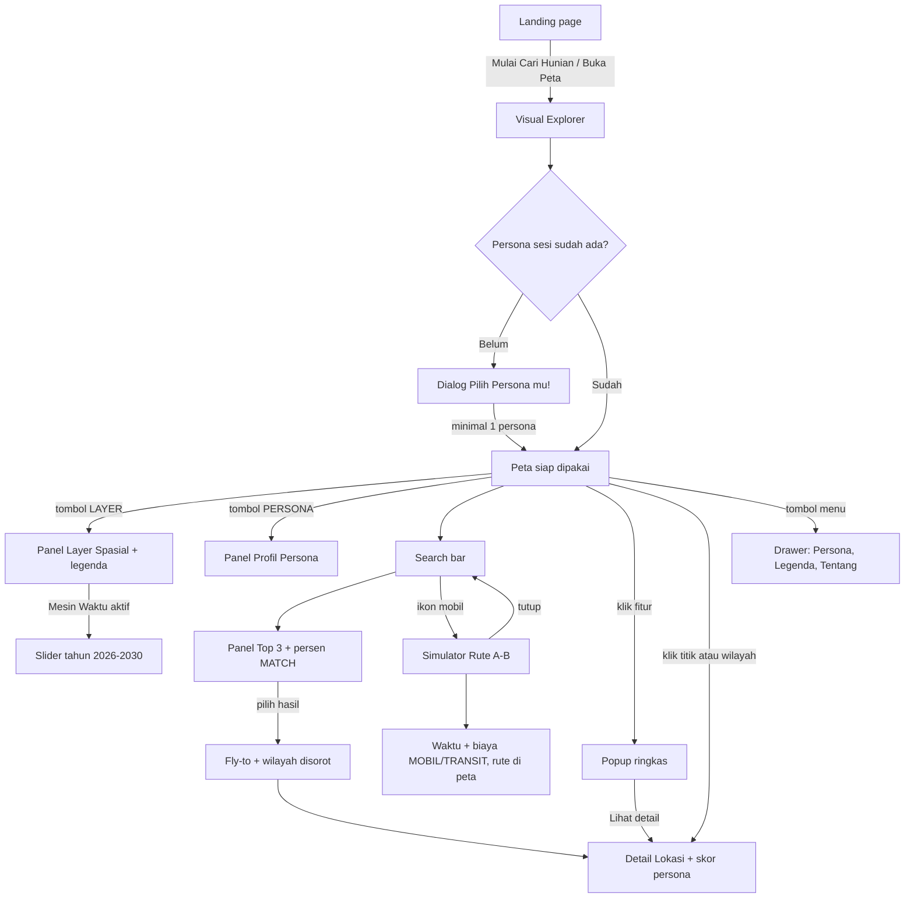
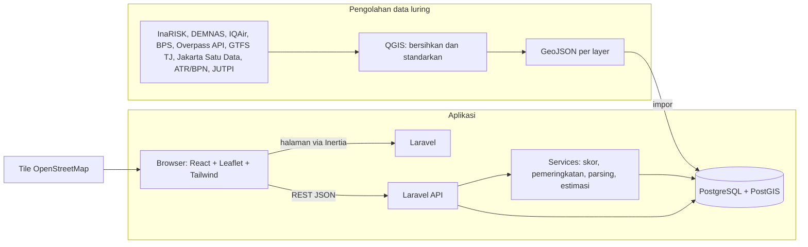

# PRD NalarRuang

## 0. Metadata Dokumen

| Butir | Isi |
|---|---|
| Judul | Product Requirements Document — NalarRuang |
| Versi | 1.2 |
| Tanggal | 29 September 2026 |
| Penyusun | Tim Kelompok 4 — Developer Rumah |
| Status | Draf untuk ditinjau tim dan Dosen Pengampu |

**Sumber dan kewenangan.**

| Sumber | Kewenangan |
|---|---|
| Desain UI final: Figma `ui-nalar-ruang`, section "putih kayak bhumi yang udah di revisi" (node 174:2) | Tampilan, tata letak, alur layar, microcopy. **Bila berbeda dengan dokumen, desain yang diikuti** dan SRS/WBS disesuaikan (keputusan tim 29 Sep 2026). |
| `docs/sumber/SRS.md` (SRS v1.2, 29 Sep 2026) | Cakupan, fungsi, aturan bisnis, data, batasan |
| `docs/sumber/WBS.md` | Jadwal sprint, deliverable, acceptance criteria work package, PIC |
| `docs/sumber/CHARTER.md` | Latar belakang saja |
| `docs/sumber/DESKRIPSI.md` | Konteks historis saja |
| `docs/RENCANA.md` | Keputusan teknis tim (stack) |
| `design-system.md` | Nilai visual, komponen, kartografi, improvisasi |

**Kebijakan desain (ringkas).** (1) Gaya visual desain final diikuti persis. (2) **Isi peta di Figma hanya ilustrasi**: bentuk area, lokasi contoh, dan rute digambar dari data (masukan Izdihar, BR-19). (3) Yang belum didesain ditulis di PRD dan diimprovisasi meniru komponen desain yang ada. (4) Masalah fungsi diselesaikan lewat perilaku, bukan perubahan tampilan.

| Versi | Tanggal | Perubahan |
|---|---|---|
| 1.0-draft | 27 Sep 2026 | Draf pertama dari SRS v1.0, WBS, dan desain Sprint 0 |
| 1.1 | 29 Sep 2026 | Acuan pindah ke desain final (section revisi); masukan Izdihar: peta dari data nyata, sembilan sumber data, ambang bintang 1,2/2,5/5 km; SRS/WBS diselaraskan (FR-22 landing page) |

---

## 1. Ringkasan Eksekutif

NalarRuang adalah aplikasi WebGIS untuk mencari kawasan hunian ideal di Jabodetabek berdasarkan gaya hidup pengguna. Pengguna memilih satu atau lebih persona (Commuter, Driver, Social & Vibe, Zen), lalu menjelajah peta dengan enam layer data spasial, mencari kawasan dan mendapat tepat tiga rekomendasi, memeriksa sebuah titik atau wilayah untuk melihat skor 0–3 bintang per persona, dan mensimulasikan waktu tempuh ke kantor atau kampus (SRS 1.4, 2.3).

Pengguna adalah calon pencari hunian yang anonim, tanpa akun (SRS U01). Masalah yang diselesaikan: keputusan memilih kawasan masih bergantung pada iklan dan klaim agen, sementara data yang relevan dengan gaya hidup tiap orang tersebar dan sulit dibaca (SRS 2.1).

Di akhir semester (27 November 2026) tim menyerahkan aplikasi web yang ter-deploy dengan landing page dan Visual Explorer yang mencakup FR-01 s.d. FR-22, enam layer data dari data sekunder publik, dokumentasi pengguna dan teknis, serta hasil pengujian (WBS D4, D5).

---

## 2. Latar Belakang & Problem Statement

Proyek bermula dari asimetri informasi properti di Jabodetabek: risiko banjir, kriminalitas, dan polusi sering tidak terungkap dalam iklan hunian (Charter; SRS 2.1). Selama Sprint 0, nilai utama bergeser menjadi **personalisasi pencarian kawasan hunian ideal berdasarkan preferensi gaya hidup** (WBS B; SRS 1.4). Kawasan yang sama bisa ideal bagi pengguna KRL dan buruk bagi yang mengutamakan ketenangan; karena itu NalarRuang menilai kawasan per persona, bukan dengan satu skor umum.

**Problem statement.** Calon penghuni di Jabodetabek tidak punya cara cepat untuk membandingkan kawasan berdasarkan kebutuhan hariannya sendiri (akses transit, akses tol, tempat nongkrong, ketenangan) dengan data yang bisa ditelusuri, sehingga keputusan diambil dari iklan dan klaim subjektif. Pesan produk di landing: "Hunian yang cocok. Kota yang terbaca." (Desain: Landing Pagee).

---

## 3. Tujuan, Non-Goals & Metrik Keberhasilan

**Tujuan.**
1. Pengguna dapat menemukan tiga kawasan yang paling sesuai kebutuhannya dari satu pencarian (FR-05, FR-06, BR-1).
2. Pengguna dapat menilai sebuah titik atau wilayah per persona dengan skor 0–3 bintang dan ringkasan (FR-09, FR-17).
3. Pengguna dapat membandingkan waktu tempuh dua moda dari calon hunian ke tempat aktivitas (FR-10, FR-11).
4. Semua fungsi FR-01 s.d. FR-22 berjalan di staging dan produksi pada 27 Nov 2026 (WBS D4, D5).

**Non-goals.** Aplikasi mobile native; listing atau transaksi properti; pengumpulan data primer (survei lapangan); analisis di luar Jabodetabek (SRS 1.4); akun dan login (SRS 2.4).

**Metrik keberhasilan.**

| Metrik | Target | Sumber |
|---|---|---|
| Requirement Search selalu mengembalikan tepat 3 rekomendasi | 100% pencarian yang berhasil | SRS BR-1 |
| Fungsi utama lulus test case | Seluruh test case; defect kritis nihil | WBS D5 |
| UAT | Diterima Dosen Pengampu | WBS D5, 1.5.2 |
| Setiap increment didemokan di staging | Sprint Review 1, 2, 3 | WBS D4, 1.4.7 |
| GeoJSON 6 layer lolos validasi dan terimpor ke PostGIS | Tanpa error | WBS D3 |
| Unit test kritis | Lulus sesuai target coverage `[TBD]` | WBS 1.5.2 |
| Waktu render peta dan respons API | `[TBD-06]` | SRS 5.1 |

---

## 4. Pengguna & Persona

**U01 — Pengguna Akhir.** Calon pencari hunian di Jabodetabek yang memakai semua fitur tanpa akun. Di awal sesi memilih minimal satu persona, boleh lebih (SRS 2.4).

| Persona | Mengutamakan | Faktor yang memengaruhi skor (WBS 1.4.5) | Layer terkait | Deskripsi di desain (dikutip) |
|---|---|---|---|---|
| Commuter | Akses transit | Jarak ke stasiun/halte | Mobilitas & Transit, Inklusivitas | "Mengutamakan akses transit, seperti stasiun dan halte." · tagline "AKSES TRANSIT PALING UTAMA" |
| Driver | Akses jalan/tol | Jarak ke gerbang tol | Mobilitas & Transit | "Mengutamakan akses jalan utama dan gerbang tol." · "JALAN LANCAR, TOL DEKAT" |
| Social & Vibe | Hiburan, kafe, restoran | Jarak ke kafe/restoran/mal | Ekosistem Mikro & Gaya Hidup | "Mengutamakan hiburan, kafe, dan restoran." · "DEKAT SERU-SERUNYA KOTA" |
| Zen | Keamanan, minim polusi, RTH | Kualitas udara (ISPU); dikurangi bila RTH terdekat jauh | Ekosistem Mikro (RTH), data kualitas udara | "Mengutamakan keamanan, minim polusi, dan ruang terbuka hijau." · "TENANG, HIJAU, LEGA" |

(Desain: dialog persona dan drawer tab Persona. Faktor skor titik ditetapkan 29 Sep 2026, lihat 7.3.)

**Skenario (SRS 4).**
- Pengguna mencentang Commuter dan Zen di awal sesi; esok harinya di sesi baru dialog muncul lagi (FR-13, FR-14).
- Pengguna Commuter mengetik "Daerah mudah transum di Bogor Kota" dan mendapat Top 3; lalu mencarikan hunian untuk orang tuanya dengan mode checkbox: kota Depok, persona Zen saja (FR-05, FR-06, FR-15).
- Di titik permukiman dekat Stasiun Bogor, skor Commuter 3 bintang karena jaraknya kurang dari 1,2 km ke stasiun; di poligon kelurahan tempat stasiun itu berada, Commuter diberi centang "cocok" karena ada stasiun di dalamnya (FR-09).
- Pengguna mengisi calon hunian dan kantor di Kuningan, lalu membandingkan waktu tempuh dan biaya kendaraan pribadi dan transportasi publik; rute tergambar menyusuri jalan (FR-10, FR-11).

---

## 5. Ruang Lingkup

| In Scope | Out of Scope |
|---|---|
| Visual Explorer: basemap, pan/zoom, highlight/dim, enam layer, slider Mesin Waktu (FR-01–04) | Aplikasi mobile native |
| Requirement Search: teks bebas, nama wilayah, mode checkbox, Top 3 dengan persen kecocokan, fly-to, toggle Commute (FR-05–07, FR-15, FR-16) | Listing dan transaksi properti |
| Smart Point Inspector + Persona Grading 0–3 bintang + auto-summary (FR-08, FR-09, FR-17) | Survei lapangan / data primer |
| Commute Simulator: Pin A/B, jarak, waktu, dan biaya dua moda, rute di peta (FR-10, FR-11) | Analisis di luar Jabodetabek |
| Onboarding persona sesi (FR-13, FR-14) | Akun, login, penyimpanan data pribadi |
| Menu utama: drawer Persona, Legenda, Tentang; panel Profil Persona (FR-18–21) | Data real-time berbayar dan scraping berita |
| Landing page (FR-22) | |
| Backend & Spatial API (FR-12) | |
| Pipeline data offline QGIS → GeoJSON → PostGIS (WBS 1.3) | |

### Kandidat Pengembangan Lanjutan (di luar MVP)
- Fitur akun untuk menyimpan preferensi lintas sesi (perlu tinjauan UU PDP, SRS 6.3, TBD-07).
- Dukungan bahasa selain Indonesia (SRS 6.2).
- Tampilan untuk perangkat mobile.

---

## 6. Konsep Produk & Alur Pengguna

NalarRuang punya dua permukaan: **Landing page** (halaman editorial) dan **Visual Explorer** (aplikasi peta). Visual Explorer adalah hub: dari satu halaman peta, pengguna bebas berpindah antara menjelajah layer, mencari, memeriksa lokasi, dan mensimulasikan perjalanan, tanpa urutan baku (SRS 4.7.3).

**Tata letak Visual Explorer** (desain final): kolom kiri berisi search bar dan satu panel isi (Top 3, Detail Lokasi, atau Simulator Rute); kanan atas tombol logo + menu; kanan bawah tombol LAYER dan PERSONA yang membuka panelnya, dan kontrol zoom; tengah bawah slider tahun saat Mesin Waktu aktif.

**Alur satu sesi.**
1. Pengguna membuka landing page, lalu menekan "Mulai Cari Hunian", "Menuju Peta", "Buka Peta Interaktif", atau "Buka Peta".
2. Visual Explorer terbuka. Karena sesi belum punya persona, dialog "Pilih Persona mu!" muncul di atas peta yang digelapkan.
3. Pengguna memilih minimal satu kartu persona dan menekan "Mulai Jelajah".
4. Pengguna bebas: menyalakan layer lewat tombol LAYER, mencari lalu memilih salah satu Top 3 (fly-to lalu Detail Lokasi terbuka), mengeklik lokasi untuk melihat skor persona, atau beralih ke Simulator Rute lewat ikon mobil.
5. Kapan saja pengguna mengubah persona lewat tombol PERSONA atau menu, membaca legenda, atau membaca tentang aplikasi.
6. Menutup tab mengakhiri sesi; persona ditanyakan lagi di sesi berikutnya.

---

## 7. Kebutuhan Fungsional per Fitur

Sumber UI: **Desain** (digambar di Figma final), **Desain + Improvisasi** (sebagian digambar), **Improvisasi** (dibangun meniru komponen desain). Nama komponen merujuk `design-system.md` bagian 8; aturan peta merujuk bagian 9 (Kartografi).

### 7.1 Visual Explorer (fitur inti)

**Deskripsi.** Peta interaktif layar penuh dengan enam layer yang dapat dinyalakan dan dimatikan sendiri-sendiri. Prioritas: Tinggi (FR-01–03), Sedang (FR-04).

**Sumber UI.** FR-01 Desain · FR-02 Improvisasi · FR-03 Desain · FR-04 Desain. (Frame: all, historis dan risiko, ekosistem micro, inklusivitas, transum, mesin waktu, legalitas lahan)

**Deskripsi UI.**
- Peta Leaflet dengan tile OpenStreetMap standar selebar layar di atas latar `map-ground`; zoom dan atribusi "Leaflet | © OpenStreetMap" di kanan bawah.
- Tombol LAYER dan PERSONA di kanan bawah. LAYER membuka panel "LAYER SPASIAL" berisi enam kartu: Historis & Risiko ("Area rawan banjir dan risiko bencana lain."), Ekosistem Mikro ("Kafe, restoran, ritel, dan ruang hijau."), Inklusivitas ("Aksesibilitas pedestrian dan fasilitas umum."), Mobilitas & Transit ("Halte, stasiun KRL/MRT, dan jalur arteri."), Mesin Waktu ("Proyek infrastruktur dan tata ruang masa depan."), Legalitas Lahan ("Gambaran status kepemilikan dan peruntukan."). Tiap kartu: nama, deskripsi, toggle navy.
- Kartu yang dinyalakan mengganti deskripsinya dengan legenda (`design-system.md` 11.4).
- Mesin Waktu menyala memunculkan slider tahun 2026–2030 di tengah bawah.
- Isi peta digambar dari data dengan aturan Kartografi: area mengikuti batas data, bukan kotak atau segitiga; titik POI di-cluster; label nama muncul mulai zoom 13 (BR-19).
- Highlight/dim `[Improvisasi]`: fitur di luar filter aktif atau di luar Top 3 diredupkan 0.35; wilayah terpilih bergaris navy; basemap tidak diubah.

**US-01** — Sebagai pengguna, saya ingin menggeser dan memperbesar peta Jabodetabek, sehingga saya bisa melihat kawasan yang saya minati. (FR-01; UC-02; UI01)
- Diberikan Visual Explorer terbuka, Ketika halaman selesai dimuat, Maka peta OpenStreetMap tampil layar penuh berpusat di Jabodetabek dengan search bar di kiri atas, tombol logo dan menu di kanan atas, tombol LAYER/PERSONA dan zoom di kanan bawah (sesuai frame all).
- Diberikan peta tampil, Ketika pengguna menyeret peta atau memakai tombol +/− atau scroll, Maka peta bergeser dan berubah zoom tanpa memuat ulang halaman.
- Diberikan tile gagal dimuat, Ketika koneksi terputus, Maka kontrol aplikasi tetap tampil dan dapat dipakai kembali setelah koneksi pulih.

**US-02** — Sebagai pengguna, saya ingin menyalakan dan mematikan tiap layer, sehingga saya hanya melihat data yang relevan. (FR-03; UC-02; UI01)
- Diberikan panel Layer tertutup, Ketika pengguna menekan tombol LAYER, Maka panel "LAYER SPASIAL" terbuka di atas tombol dan tombol LAYER berisi navy.
- Diberikan semua layer mati, Ketika pengguna menyalakan toggle "Inklusivitas", Maka titik akses disabilitas (biru langit) dan trotoar layak (biru putus-putus) tampil di peta, dan kartu menampilkan legendanya.
- Diberikan dua layer aktif, Ketika pengguna mematikan salah satunya, Maka hanya data layer itu yang hilang dan kartunya kembali menampilkan deskripsi.
- Diberikan enam layer aktif, Maka panel tetap dalam layar dan isinya dapat di-scroll (sesuai frame all).
- Edge: data layer gagal dimuat → kartu menampilkan "Layer gagal dimuat." dan "Coba lagi", toggle dinonaktifkan, basemap tetap tampil (UC-02 AF1) `[Improvisasi]`.

**US-03** — Sebagai pengguna, saya ingin area yang relevan disorot dan area lain diredupkan, sehingga fokus saya terjaga. (FR-02; UC-02) `[Improvisasi]`
- Diberikan Requirement Search menghasilkan Top 3, Ketika hasil tampil, Maka tiga wilayah hasil digambar dengan garis navy dan nomor peringkat, fitur layer di luar ketiganya diredupkan, tanpa mengubah basemap.
- Diberikan filter dihapus (panel Top 3 ditutup atau search dikosongkan), Maka semua fitur kembali normal tanpa memuat ulang halaman; target waktu `[TBD-06]`.

**US-04** — Sebagai pengguna, saya ingin memilih tahun pada Mesin Waktu, sehingga saya melihat proyek infrastruktur tahun itu. (FR-04; BR-3)
- Diberikan Mesin Waktu mati, Ketika pengguna menyalakannya, Maka slider tahun muncul di tengah bawah (sesuai frame mesin waktu).
- Diberikan slider pada 2029, Ketika pengguna menggeser ke 2027, Maka nilai tahun berubah menjadi 2027 dan peta hanya menampilkan proyek tahun 2027 (garis ungu putus-putus mengikuti trase proyek).
- Edge: tidak ada proyek pada tahun terpilih → garis tidak tampil dan slider menampilkan "Belum ada proyek di tahun ini." `[Improvisasi]`.

**US-05** — Sebagai pengguna, saya ingin mengeklik fitur di peta dan membaca penjelasannya, sehingga saya paham arti titik atau area itu. (FR-03, FR-08; UC-04)
- Diberikan layer Ekosistem aktif, Ketika pengguna mengeklik titik hijau, Maka popup ringkas tampil dengan jenis, nama, isi dari data, sumber, dan tautan "Lihat detail" `[Improvisasi]`.
- Diberikan popup terbuka, Ketika pengguna mengeklik fitur lain, Maka popup lama tertutup dan hanya satu lokasi yang terpilih (BR-13).
- Diberikan popup akan tampil di dekat kolom kiri atau panel kanan, Maka peta bergeser otomatis sehingga popup tidak tertutup (BR-15).

**Dependensi.** WBS 1.3, 1.4.1, 1.4.3, 1.4.6.2. TBD-06, OQ-07.

### 7.2 Requirement Search (fitur inti)

**Deskripsi.** Satu search bar untuk teks bebas, nama wilayah, atau mode checkbox kota + persona, menghasilkan tepat tiga rekomendasi dengan persen kecocokan. Prioritas: Tinggi (FR-05, FR-06), Sedang (FR-07, FR-15, FR-16).

**Sumber UI.** FR-05 Desain · FR-06 Desain · FR-07 Improvisasi (keadaan sesudah fly-to) · FR-15 Improvisasi · FR-16 Desain. (Frame: top 3, Simulasi Rute)

**Deskripsi UI.**
- Search bar 360 × 48 di kiri atas: ikon kaca pembesar, placeholder "Telusuri kawasan atau alamat...", pemisah, tombol ikon mobil (toggle Commute).
- Hasil berupa panel "TOP 3 REKOMENDASI" di bawah search bar dengan subjudul "Kawasan ideal berdasarkan profil [Persona]." dan tiga baris: nomor peringkat, nama kawasan, tipe kawasan (mis. "Urban Terpadu"), persen hijau + "MATCH".
- Mode checkbox `[Improvisasi]`: ikon pengaturan muncul di search saat fokus; membuka panel bergaya Top 3 berisi pilihan kota, baris persona (gaya Profil Persona), tautan "Pakai persona sesi", dan tombol "Cari".
- Sesudah fly-to `[Improvisasi]`: wilayah hasil disorot garis navy, panel Top 3 berganti Detail Lokasi untuk kawasan itu.

**US-06** — Sebagai pengguna, saya ingin mengetik kebutuhan atau nama wilayah, sehingga saya tidak perlu tahu nama kawasan terlebih dulu. (FR-05; UC-03; UI02)
- Diberikan search bar kosong, Ketika pengguna mengetik "Daerah mudah transum di Bogor Kota" dan menekan Enter, Maka panel "TOP 3 REKOMENDASI" tampil di bawah search bar.
- Diberikan pengguna mengetik "Kecamatan Cibubur", Ketika Enter, Maka hasil dibatasi pada wilayah itu.
- Cara menafsirkan teks bebas mengikuti keputusan TBD-11 (usulan: parsing berbasis aturan + kamus; artifact Audit Sumber Data, bagian Rancangan sistem).

**US-07** — Sebagai pengguna, saya ingin melihat tepat tiga rekomendasi dengan tingkat kecocokannya, sehingga saya bisa langsung membandingkan. (FR-06; BR-1; UC-03)
- Diberikan pencarian berhasil, Maka panel berisi tepat tiga baris berurutan sesuai peringkat, masing-masing nomor, nama kawasan, tipe kawasan, dan persen kecocokan (sesuai frame top 3).
- Persen kecocokan adalah skor pencarian 0–100 hasil perhitungan, bukan angka contoh (BR-18).
- Diberikan persona sesi Commuter, Maka peringkat memakai persona sesi sebagai bobot bawaan dan subjudul berbunyi "Kawasan ideal berdasarkan profil Commuter."
- Edge: tidak ada lokasi yang cocok → panel menampilkan "Belum ada kawasan yang cocok" dan "Coba longgarkan kata kunci atau pilih kota lain." (UC-03 AF1) `[Improvisasi]`.
- Edge: kawasan yang memenuhi kurang dari tiga → tetap tiga dengan mengisi sisanya dari skor tertinggi berikutnya (BR-1; OQ-04).

**US-08** — Sebagai pengguna, saya ingin peta terbang ke rekomendasi yang saya pilih, sehingga saya langsung melihat lokasinya. (FR-07; UC-03)
- Diberikan panel Top 3 tampil, Ketika pengguna memilih baris kedua, Maka kamera beranimasi (fly-to) ke kawasan itu, batas wilayahnya disorot garis navy, dan Detail Lokasi terbuka menggantikan panel Top 3.
- Diberikan preferensi "kurangi gerakan" aktif, Maka peta berpindah tanpa animasi.

**US-09** — Sebagai pengguna, saya ingin memilih kota dan persona untuk satu pencarian, sehingga saya bisa mencarikan hunian untuk orang lain. (FR-15; BR-12; UC-03 AF2) `[Improvisasi]`
- Diberikan persona sesi Commuter, Ketika pengguna membuka mode checkbox, memilih "Depok", mencentang hanya "Zen", lalu mencari, Maka hasil dihitung untuk Zen di Depok.
- Diberikan pencarian tersebut selesai, Maka persona sesi tetap Commuter (BR-12).
- Diberikan pengguna menekan "Pakai persona sesi", Maka centang persona diisi sesuai persona sesi.

**US-10** — Sebagai pengguna, saya ingin beralih dari pencarian ke simulasi perjalanan dari search bar yang sama, sehingga alurnya seperti Google Maps. (FR-16; UC-03 AF2; UI02)
- Diberikan search bar tampil, Ketika pengguna menekan ikon mobil, Maka tombol ikon berisi navy dan kartu "SIMULATOR RUTE" menggantikan panel di bawah search bar (sesuai frame Simulasi Rute).
- Diberikan kartu Simulator Rute tampil, Ketika pengguna menekan tombol tutup atau ikon mobil lagi, Maka kartu tertutup dan search kembali ke mode pencarian.

**Dependensi.** WBS 1.4.2, 1.4.6.2, 1.2.3. TBD-05, TBD-11, OQ-04.

### 7.3 Smart Point Inspector + Persona Grading (fitur inti)

**Deskripsi.** Panel "Detail Lokasi" yang muncul saat titik atau poligon diklik, berisi skor 0–3 bintang untuk empat persona dan kesimpulan untuk tiap persona sesi. Prioritas: Tinggi (FR-08, FR-09), Sedang (FR-17).

**Sumber UI.** FR-08 Desain · FR-09 Desain + Improvisasi · FR-17 Desain + Improvisasi. (Frame: all, historis dan risiko, ekosistem micro, transum, mesin waktu, legalitas lahan)

**Deskripsi UI.**
- Panel "Detail Lokasi" di kolom kiri di bawah search bar, sampai bawah layar, dengan tombol tutup di kanan atas panel.
- Blok tempat: lingkaran pin merah, label "AREA TERPILIH", nama lokasi (Fraunces), nama wilayah.
- "Kecocokan Gaya Hidup": empat baris persona (ikon, nama, tiga bintang). Persona sesi: baris putih bergaris dengan badge "PROFIL ANDA" dan bintang merah muda; persona lain tanpa latar, nama redup, bintang lebih muda.
- Kartu "KESIMPULAN SINGKAT" berisi kalimat seperti "Buat gaya hidup Commuter: Sangat mendukung aktivitasmu!".
- `[Improvisasi]` Varian titik memakai label "TITIK TERPILIH"; varian wilayah "AREA TERPILIH".
- `[Improvisasi]` Ringkasan data layer aktif di lokasi, di antara skor dan kesimpulan.
- `[Improvisasi]` Titik di area non-hunian (monumen, taman kota, badan air, tol) diberi keterangan "bukan kawasan hunian" (design-system 9.2).
- `[Improvisasi]` Skor 0: tiga bintang kosong dan "0 dari 3".

**Aturan Persona Grading (SRS FR-09, BR-9, BR-10; dikonfirmasi PM 29 Sep 2026).**
- Skala: 0 = tidak ada/buruk, 1 = sekadar ada, 2 = bagus, 3 = sangat bagus.
- **Titik**: 0–3 bintang. Commuter, Driver, dan Social & Vibe dari jarak titik terpilih ke **fasilitas utama** persona yang terdekat; Zen dari kualitas udara.

  | Persona | Fasilitas utama | Penyesuaian |
  |---|---|---|
  | Commuter | Stasiun KRL/MRT/LRT atau halte TransJakarta | — |
  | Driver | Gerbang tol | — |
  | Social & Vibe | Kafe, restoran, atau mal | — |
  | Zen | Kualitas udara (kategori ISPU) + ruang terbuka hijau (taman, hutan kota) | Lihat tabel Zen |

  | Bintang | Jarak ke fasilitas utama |
  |---|---|
  | 3 | ≤ 1,2 km (15-minute city) |
  | 2 | ≤ 2,5 km |
  | 1 | ≤ 5 km |
  | 0 | > 5 km |

  | Zen | Nilai |
  |---|---|
  | Kualitas udara sehat / kurang sehat / tidak sehat / berbahaya | 3 / 2 / 1 / 0 bintang |
  | RTH terdekat ≤ 1,2 km | tetap |
  | RTH terdekat > 1,2 km sampai 5 km | −1 bintang |
  | Tidak ada RTH dalam 5 km | −2 bintang (minimal 0) |
- **Wilayah (poligon)**: **tanpa bintang** (TBD-09 selesai; kuantitas fasilitas tidak bisa dipukul rata antarwilayah). Tiap persona diberi centang **cocok** bila di dalam wilayah ada minimal satu fasilitas utamanya, atau tanda **belum cocok** bila tidak. Zen cocok bila kualitas udara sehat atau kurang sehat dan ada RTH di dalam wilayah.
- Bobot dan ambang disimpan sebagai konstanta dan dapat disesuaikan setelah uji coba (BR-2).
- Auto-summary hanya untuk persona sesi (BR-11), pola "Buat gaya hidup [Persona]: [frasa]": 3 "Sangat mendukung aktivitasmu!" (desain), 2 "Cukup mendukung aktivitasmu." `[Improvisasi]`, 1 "Mungkin kurang optimal, pertimbangkan lokasi lain." (desain), 0 "Belum mendukung aktivitasmu, pertimbangkan lokasi lain." `[Improvisasi]`. Wilayah: "Cocok untuk gaya hidup [Persona]." / "Belum cocok untuk gaya hidup [Persona]." `[Improvisasi]`.
- Skor di desain adalah data contoh; aplikasi menampilkan hasil perhitungan (BR-18).

**US-11** — Sebagai pengguna, saya ingin membuka detail lokasi dengan mengeklik peta dan menutupnya lagi, sehingga saya bisa memeriksa banyak lokasi. (FR-08; UC-04; UI03)
- Diberikan peta tampil, Ketika pengguna mengeklik sebuah poligon, Maka panel "Detail Lokasi" muncul di kolom kiri dengan label "AREA TERPILIH", nama, dan wilayah (sesuai frame all).
- Diberikan panel terbuka, Ketika pengguna menekan tombol tutup di kanan atas panel atau Esc, Maka panel tertutup dan fokus kembali ke peta.
- Diberikan panel terbuka, Ketika pengguna mengeklik lokasi lain, Maka isi panel berganti ke lokasi baru; tidak ada panel kedua (BR-13).
- Diberikan panel terbuka, Maka search bar, tombol logo/menu, tombol LAYER/PERSONA, dan zoom tetap terlihat dan dapat diklik (BR-15).
- Edge: lokasi tanpa data pada layer aktif → "Data belum tersedia di sini" dengan teks "Layer ini belum punya data untuk lokasi yang kamu pilih." (UC-04 AF1) `[Improvisasi]`.

**US-12** — Sebagai pengguna, saya ingin melihat skor keempat persona di satu lokasi, sehingga saya tahu lokasi itu cocok untuk gaya hidup apa. (FR-09; BR-9; UC-05)
- Diberikan panel terbuka, Maka "Kecocokan Gaya Hidup" menampilkan empat baris Commuter, Driver, Social & Vibe, Zen, masing-masing 0–3 bintang (titik) atau centang cocok/belum cocok (wilayah) hasil perhitungan.
- Diberikan pembaca layar aktif, Ketika fokus pada baris Commuter bernilai 3, Maka dibacakan "Commuter, 3 dari 3 bintang"; pada wilayah "Commuter, cocok".

**US-13** — Sebagai pengguna, saya ingin tahu apakah yang saya pilih titik atau wilayah, sehingga saya paham cara skornya dihitung. (FR-09; BR-10) `[Improvisasi]`
- Diberikan pengguna mengeklik titik, Maka label berbunyi "TITIK TERPILIH" dan skor dihitung dengan jarak ke fasilitas utama.
- Diberikan pengguna mengeklik poligon, Maka label berbunyi "AREA TERPILIH" dan tiap persona diberi centang cocok/belum cocok, tanpa bintang.
- Diberikan titik permukiman berjarak 1,0 km dari Stasiun Bogor, Maka skor Commuter 3 bintang; bila 2,0 km, 2 bintang; bila 4,0 km, 1 bintang; bila 6,0 km, 0 bintang.
- Diberikan titik dengan kualitas udara "kurang sehat" dan RTH terdekat 3 km, Maka skor Zen 1 bintang (2 − 1).

**US-14** — Sebagai pengguna dengan beberapa persona, saya ingin kesimpulan untuk tiap persona saya, sehingga saya tidak perlu menafsirkan bintang sendiri. (FR-17; BR-11; FR-14)
- Diberikan persona sesi Commuter dan Zen, Ketika panel dibuka, Maka baris Commuter dan Zen sama-sama bergaya persona sesi dengan badge "PROFIL ANDA", Driver dan Social & Vibe redup, dan kartu "KESIMPULAN SINGKAT" berisi dua kalimat.
- Diberikan persona sesi hanya Commuter dengan skor 1, Maka kesimpulan berbunyi "Buat gaya hidup Commuter: Mungkin kurang optimal, pertimbangkan lokasi lain." (sesuai frame all).
- Diberikan pengguna mengubah persona lewat drawer atau panel Profil Persona, Ketika panel masih terbuka, Maka badge dan kalimat langsung menyesuaikan tanpa memuat ulang.

**US-15** — Sebagai pengguna, saya ingin tahu bila data di lokasi tidak lengkap, sehingga saya tidak salah menilai skor. (UC-05 AF1) `[Improvisasi]`
- Diberikan layer pendukung skor tidak punya data di lokasi, Maka persona terkait menampilkan "Data kurang" dan kesimpulan menambahkan "Sebagian data di lokasi ini belum lengkap, jadi skornya bisa berubah."

**Dependensi.** WBS 1.4.4, 1.4.5, 1.4.6.2. TBD-05; data kualitas udara (IQAir/ISPU).

### 7.4 Commute Simulator (fitur inti)

**Deskripsi.** Estimasi jarak, waktu tempuh, dan biaya antara calon hunian (A) dan tujuan (B) untuk kendaraan pribadi dan transportasi publik, dengan rute tergambar di peta. Prioritas: Sedang (FR-10, FR-11).

**Sumber UI.** FR-10 Desain + Improvisasi · FR-11 Desain + Improvisasi. (Frame: Simulasi Rute)

**Deskripsi UI.**
- Kartu "SIMULATOR RUTE" di kolom kiri di bawah search bar: titik A (lingkaran navy) dan B (lingkaran putih) dengan isian alamat, dihubungkan garis putus; dua kotak moda "MOBIL" dan "TRANSIT", masing-masing waktu ("12 mnt") dan biaya ("Rp 34.033").
- Rute di peta mengikuti jaringan jalan (mobil) atau jalur transit + jalan kaki (transit), dengan panah arah dari A ke B dan titik pindah moda (BR-19, design-system 9.3). Garis lurus A–B dari desain tidak ditiru.
- `[Improvisasi]` Keadaan kosong: placeholder "Ketik alamat atau pilih di peta" dan tautan "Pilih di peta"; kotak moda berisi "—".
- `[Improvisasi]` Kotak moda dapat dipilih; rute moda terpilih digambar tebal. Chip jarak di kepala kartu; keterangan "Estimasi tanpa lalu lintas real-time." dan rincian moda transit di bawah kotak.

**US-16** — Sebagai pengguna, saya ingin menentukan titik rumah dan tujuan lewat teks atau klik peta, sehingga saya bisa memakai cara yang paling mudah. (FR-10; UC-06; UI04)
- Diberikan kartu Simulator Rute kosong, Ketika pengguna mengetik alamat di baris A dan memilih salah satu saran, Maka penanda A tampil di peta.
- Diberikan kartu kosong, Ketika pengguna menekan "Pilih di peta" pada baris B lalu mengeklik peta, Maka penanda B tampil dan baris terisi nama tempat.
- Diberikan kedua titik terisi, Ketika pengguna menekan tombol reset, Maka kedua baris kosong, penanda dan rute hilang `[Improvisasi]`.
- Diberikan Detail Lokasi terbuka untuk suatu lokasi, Ketika pengguna beralih ke Simulator Rute, Maka lokasi itu terisi otomatis sebagai titik A `[Improvisasi]`.

**US-17** — Sebagai pengguna, saya ingin membandingkan waktu tempuh dua moda, sehingga saya tahu trade-off mobilitas. (FR-11; UC-06)
- Diberikan kedua titik terisi, Maka kotak "MOBIL" dan "TRANSIT" menampilkan waktu tempuh dan biaya masing-masing (sesuai frame Simulasi Rute), dan rute kedua moda tergambar di peta menyusuri jalan/jalur dengan panah arah A→B.
- Diberikan pengguna memilih kotak "TRANSIT", Maka kotak itu bergaris navy dan rute transit tampil tebal, rute mobil tipis.
- Edge: rute satu moda tidak ditemukan → kotak moda itu menampilkan "Tidak tersedia" dan "Coba titik yang lebih dekat ke jalan"; moda lain tetap tampil (UC-06 AF1) `[Improvisasi]`.

**US-18** — Sebagai pengguna, saya ingin melihat perkiraan biaya tiap moda, sehingga saya bisa menimbang ongkos harian. (FR-11)
- Diberikan estimasi tampil, Maka tiap kotak moda menampilkan biaya dalam Rupiah hasil perhitungan (tarif transit, BBM, tol).
- Edge: biaya tidak tersedia untuk suatu moda → teks biaya diganti "Biaya tidak tersedia" `[Improvisasi]`.
- Sumber data waktu tempuh dan biaya: OQ-02, OQ-03 (TBD-ROUTE).

**Dependensi.** WBS 1.4.5. TBD-ROUTE (OQ-02), OQ-03.

### 7.5 Onboarding Persona (fitur pendukung)

**Deskripsi.** Dialog pemilihan persona di awal setiap sesi. Prioritas: Tinggi (FR-13, FR-14).

**Sumber UI.** FR-13 Desain · FR-14 Desain + Improvisasi (penyimpanan sesi adalah perilaku). (Frame: persona)

**Deskripsi UI.** Dialog krem lebar 1200 di atas peta yang digelapkan navy: judul "Pilih Persona mu!", pengantar "Pilih minimal satu persona yang menggambarkan keseharianmu untuk mendapatkan rekomendasi dan kurasi hunian yang tepat sasaran.", empat kartu persona (ikon, lingkaran pilih, nomor + tagline, nama Georgia, deskripsi), tombol "Mulai Jelajah" dengan panah di kanan bawah. Kartu terpilih: latar putih sedikit membesar, lingkaran merah marun berisi centang. Tidak ada tombol tutup.

**US-19** — Sebagai pengguna baru di sesi ini, saya ingin memilih persona sebelum menjelajah, sehingga hasil disesuaikan dengan gaya hidup saya. (FR-13; BR-7; UC-01; UI00)
- Diberikan sesi baru tanpa persona, Ketika Visual Explorer terbuka, Maka dialog "Pilih Persona mu!" tampil dengan empat kartu persona (sesuai frame persona).
- Diberikan tidak ada kartu terpilih, Maka tombol "Mulai Jelajah" tampil redup; menekannya memunculkan "Pilih minimal satu persona dulu, ya." `[Improvisasi]`.
- Diberikan pengguna menekan Esc atau mengeklik di luar dialog, Maka dialog tetap terbuka (UC-01 AF1).
- Diberikan pengguna memilih Commuter dan Zen lalu menekan "Mulai Jelajah", Maka dialog tertutup dan kedua persona menjadi persona sesi.

**US-20** — Sebagai pengguna, saya ingin preferensi persona hanya berlaku di sesi ini, sehingga tidak ada data saya yang tersimpan permanen. (FR-14; BR-6; SRS 5.2)
- Diberikan persona sesi tersimpan, Ketika pengguna berpindah antarfitur atau memuat ulang tab yang sama, Maka persona tetap berlaku.
- Diberikan pengguna menutup tab lalu membuka NalarRuang lagi, Maka dialog persona muncul kembali.
- Persona tidak pernah dikirim untuk disimpan di server dan tidak disimpan di cookie jangka panjang; hanya dikirim sebagai parameter permintaan pencarian dan skor.

**Dependensi.** Tidak ada ke backend.

### 7.6 Menu Utama (fitur pendukung)

**Deskripsi.** Drawer dari kiri dengan tab Persona, Legenda, Tentang, dibuka dari tombol logo + menu; ditambah panel Profil Persona dari tombol PERSONA untuk mengganti persona cepat. Prioritas: Sedang (FR-18, FR-19), Rendah (FR-20, FR-21).

**Sumber UI.** FR-18 Desain · FR-19 Desain · FR-20 Desain · FR-21 Desain + Improvisasi. (Frame: setting persona, setting legenda, setting tentang, persona)

**Deskripsi UI.** Drawer 320 berlatar krem: wordmark "NalarRuang" dan tombol tutup; tab "Persona", "Legenda", "Tentang"; isi berlatar putih. Tab Persona: "Ubah Preferensi Persona", "Pilih persona yang mewakili keseharianmu. Ini akan mengubah rekomendasi di peta secara instan.", empat kartu persona dengan kotak centang navy. Tab Legenda: "Legenda Peta", "Panduan membaca simbol dan warna pada Visual Explorer.", satu baris per layer. Tab Tentang: "Tentang NalarRuang 2.0", deskripsi platform, kartu istilah (Isochrone, Point Inspector, Commute Simulator, Persona Grading); `[Improvisasi]` ditambah kartu Sumber data dan Catatan (disclaimer, identitas tim). Panel Profil Persona: "PROFIL PERSONA", empat baris nama persona dengan checkbox.

**US-21** — Sebagai pengguna, saya ingin membuka menu dari peta, sehingga pengaturan dan penjelasan mudah dijangkau. (FR-18; UC-07; UI05)
- Diberikan Visual Explorer, Ketika pengguna menekan tombol logo/menu di kanan atas, Maka drawer terbuka dari kiri dengan tab "Persona" terpilih dan peta di belakang digelapkan (sesuai frame setting persona).
- Diberikan drawer terbuka, Ketika pengguna menekan tombol tutup, Esc, atau area gelap, Maka drawer tertutup dan fokus kembali ke tombol menu.

**US-22** — Sebagai pengguna, saya ingin mengubah persona kapan saja tanpa memuat ulang, sehingga saya bisa membandingkan hasil. (FR-19; BR-8; UC-07)
- Diberikan persona sesi Driver, Ketika pengguna memilih "Zen" di tab Persona atau di panel Profil Persona, Maka persona sesi menjadi Driver dan Zen, dan badge, kesimpulan, serta Top 3 yang terbuka diperbarui tanpa memuat ulang.
- Diberikan hanya satu persona terpilih, Ketika pengguna mencoba menghapusnya, Maka pilihan tetap dan toast "Pilih minimal satu persona dulu, ya." tampil (BR-7).
- Edge: perubahan gagal disimpan → toast "Gagal menyimpan preferensi. Coba pilih lagi." dan preferensi sebelumnya dipertahankan (UC-07 AF1) `[Improvisasi]`.

**US-23** — Sebagai pengguna baru, saya ingin membaca arti simbol peta, sehingga saya paham peta. (FR-20; UC-07)
- Diberikan tab "Legenda" dipilih, Maka tampil satu baris per layer dengan simbol berwarna sesuai yang digambar di peta dan teks legenda (sesuai frame setting legenda; warna simbol KRL dan trotoar mengikuti `design-system.md` 3.3).

**US-24** — Sebagai pengguna, saya ingin membaca informasi umum aplikasi, sehingga saya tahu istilah, asal data, dan batasannya. (FR-21; UC-07)
- Diberikan tab "Tentang" dipilih, Maka tampil deskripsi NalarRuang dan kartu istilah (sesuai frame setting tentang), kartu Sumber data berisi sembilan sumber (bagian 9), dan disclaimer "Skor dan rekomendasi merupakan estimasi dari data sekunder publik." `[Improvisasi]`.

**Dependensi.** FR-13, FR-14.

### 7.7 Landing Page (fitur pendukung)

**Deskripsi.** Halaman editorial yang menjelaskan produk dan mengarahkan ke peta. Prioritas: Rendah (FR-22).

**Sumber UI.** Desain (frame Landing Pagee) + Improvisasi (gambar fitur, isi Sumber Data).

**Deskripsi UI.** Header (MENU, wordmark, "Menuju Peta"); hero "Hunian yang cocok. Kota yang terbaca." dengan kicker "Data Spasial · Persona · Rekomendasi"; marquee nama fitur; "Mengurai Visi, / Menata Kota Bersama." dengan kolom Spasial, Persona, Rekomendasi; **Our Vision**; **Mission** 01–03; "Empat Cara Memandang Suatu Kota." (kartu foto persona); "Tiga cara menjelajah." (Requirement Search, Smart Point Inspector, Commute Simulator); "Enam layer, satu kota."; "Sumber Data Terbuka"; "Dari Data Terbuka ke Rekomendasi." (Kumpulkan, Olah, Hitung, Tampilkan); **Coba Sekarang** dengan tombol "BUKA PETA"; FAQ "Hal yang perlu kamu tahu."; CTA "Siap membaca kotamu sendiri?" dengan "MULAI CARI HUNIAN"; footer (Sekolah Vokasi IPB, kontak, media sosial, disclaimer).
- `[Improvisasi]` Gambar tiga fitur dibuat dari peta asli sesuai Kartografi, bukan ilustrasi Figma (kotak biru, pin di Monas, garis lurus): tiga poligon kelurahan bernomor; pin di permukiman dengan label "★ 3/3 Sangat Cocok"; rute yang menyusuri jalan dengan panah arah.
- Sumber Data Terbuka berisi sembilan sumber tanpa duplikasi (bagian 9).

**US-25** — Sebagai calon pengguna, saya ingin memahami apa itu NalarRuang sebelum membuka peta, sehingga saya tahu manfaatnya. (FR-22)
- Diberikan pengguna membuka URL utama, Maka landing page tampil dengan seluruh seksi sesuai frame Landing Pagee.
- Diberikan pengguna menekan "Mulai Cari Hunian", "Menuju Peta", "Buka Peta Interaktif", atau "Buka Peta", Maka Visual Explorer terbuka.
- Diberikan seksi "Tiga cara menjelajah", Maka gambar tiap fitur menampilkan peta asli (poligon mengikuti batas, pin di kawasan hunian, rute menyusuri jalan).

**US-26** — Sebagai calon pengguna, saya ingin jawaban atas pertanyaan umum dan tahu sumber datanya, sehingga saya percaya pada datanya. (FR-22; SRS 5.2, B07)
- Diberikan seksi "Sumber Data Terbuka", Maka tampil sembilan sumber: InaRISK, DEMNAS, IQAir, BPS, Overpass API, GTFS Transjakarta, Jakarta Satu Data, ATR/BPN, JUTPI Phase 3.
- Diberikan FAQ, Ketika pengguna membuka "Datanya dari mana?", Maka jawaban "NalarRuang memakai data sekunder publik dari InaRISK, DEMNAS, IQAir, BPS, Overpass API (OpenStreetMap), GTFS Transjakarta, Jakarta Satu Data, ATR/BPN, dan JUTPI Phase 3." tampil; hanya satu item terbuka pada satu waktu.
- Jawaban lain: tanpa login; persona hanya tersimpan selama sesi di browser; skor adalah estimasi dari data sekunder publik; cakupan Jabodetabek.
- Footer selalu menampilkan "Skor dan rekomendasi merupakan estimasi dari data sekunder publik."

**Dependensi.** Tidak ada ke backend. OQ-09 (domain/email).

### 7.8 Backend & Spatial API (fitur pendukung)

**Deskripsi.** RESTful API JSON untuk data layer, Requirement Search, skor persona, dan commute. Prioritas: Tinggi (FR-12).

**Sumber UI.** Tidak berlaku (non-UI).

**US-27** — Sebagai tim frontend, saya ingin endpoint JSON yang stabil, sehingga fitur peta bisa dibangun paralel. (FR-12; COM02; WBS 1.4.6.2)
- Diberikan layer aktif dan batas tampilan peta, Ketika frontend meminta data layer, Maka API mengembalikan GeoJSON yang difilter sesuai bounding box.
- Diberikan parameter pencarian dan persona, Ketika frontend meminta Requirement Search, Maka API mengembalikan tepat tiga hasil berperingkat beserta tipe kawasan, persen kecocokan, alasan, dan geometri wilayah (BR-1).
- Diberikan sebuah lokasi dan persona sesi, Ketika frontend meminta skor, Maka API mengembalikan jenis geometri, nama dan wilayah, skor 0–3 untuk empat persona, status kelengkapan data, dan ringkasan layer.
- Diberikan Pin A dan Pin B, Ketika frontend meminta estimasi, Maka API mengembalikan per moda jarak, waktu, biaya, dan geometri rute searah A→B, atau status "tidak tersedia".
- Semua endpoint lulus uji fungsional dasar sesuai kontrak API; kontrak dibekukan setelah disepakati (`docs/SISTEM.md` bagian 2).

**Dependensi.** WBS 1.2.2, 1.2.3, 1.3.2, 1.4.6.1. TBD-04, TBD-06.

---

## 8. Business Rules

| ID | Aturan | Rujukan |
|---|---|---|
| BR-1 | Setiap hasil Requirement Search menampilkan tepat 3 rekomendasi. | SRS 5.6-1; FR-06 |
| BR-2 | Bobot dan ambang skor persona dapat disesuaikan setelah uji coba data nyata. | SRS 5.6-2; TBD-05 |
| BR-3 | Layer Mesin Waktu hanya menampilkan proyek sesuai tahun di slider. | SRS 5.6-3; FR-04 |
| BR-4 | Hanya data sekunder publik; tanpa data primer. | SRS 5.6-4; B07 |
| BR-5 | Analisis dan rekomendasi terbatas pada Jabodetabek. | SRS 5.6-5; B05 |
| BR-6 | Preferensi persona berbasis sesi; ditanyakan ulang di sesi baru. | SRS 5.6-6; FR-14 |
| BR-7 | Minimal satu persona wajib dipilih; boleh lebih. | SRS 5.6-7; FR-13 |
| BR-8 | Persona dapat diubah kapan saja lewat drawer atau panel Profil Persona tanpa onboarding ulang atau reload. | SRS 5.6-8; FR-19 |
| BR-9 | Skor memakai skala 0–3 bintang. | SRS 5.6-9 |
| BR-10 | Titik: jarak ke fasilitas utama persona (3 ≤ 1,2 km, 2 ≤ 2,5 km, 1 ≤ 5 km, 0 > 5 km); Zen: kualitas udara 3/2/1/0 dikurangi jarak RTH (−1 bila > 1,2 km, −2 bila tidak ada dalam 5 km); poligon: centang cocok/belum cocok, tanpa bintang. | SRS 5.6-10; FR-09 |
| BR-11 | Auto-summary hanya untuk persona sesi. | SRS 5.6-11; FR-17 |
| BR-12 | Pilihan kota dan persona di mode checkbox hanya berlaku untuk pencarian itu. | SRS 5.6-12; FR-15 |
| BR-13 | Hanya satu lokasi terpilih pada satu waktu; popup dan Detail Lokasi selalu merujuk lokasi yang sama. | Perilaku |
| BR-14 | Setiap persona sesi mendapat gaya baris persona sesi, badge "PROFIL ANDA", dan kalimat kesimpulan sendiri. | Desain; FR-14, FR-17 |
| BR-15 | Search bar, tombol logo/menu, tombol LAYER/PERSONA, dan zoom selalu terlihat dan dapat diklik saat panel atau popup terbuka (drawer/dialog modal dikecualikan selama terbuka). | Perilaku |
| BR-16 | Teks legenda dan keterangan mengikuti data yang benar-benar ditampilkan. | SRS FR-20 |
| BR-17 | Disclaimer estimasi tersedia di landing dan tab Tentang. | SRS 5.6-14 |
| BR-18 | Skor, persen kecocokan, waktu, jarak, dan biaya di desain adalah contoh; aplikasi menampilkan hasil perhitungan. | Desain |
| BR-19 | Isi peta digambar dari data sebenarnya: area mengikuti batas data (bukan kotak/segitiga), lokasi contoh berupa kawasan hunian (bukan Monas), rute mengikuti jalan/jalur dan menunjukkan arah. Ilustrasi peta di Figma tidak ditiru. | SRS 5.6-13; masukan Izdihar 29 Sep 2026 |

---

## 9. Data & Layer Spasial

**Sumber data resmi (SRS B07, daftar Izdihar 29 Sep 2026):** InaRISK (BNPB) · DEMNAS (BIG) · IQAir · BPS · Overpass API (OpenStreetMap) · GTFS Transjakarta · Jakarta Satu Data · ATR/BPN · JUTPI Phase 3. Hasil uji akses tiap sumber, alternatifnya, dan evaluasi kesesuaiannya ada di artifact **Audit Sumber Data NalarRuang** (https://claude.ai/artifact/PwTA6cASf1zAJQCDuVrz7b).

| Layer | Isi data | Sumber | Geometri | Tampilan (design-system 3.3) | Dipakai oleh | Keterbatasan |
|---|---|---|---|---|---|---|
| Historis & Risiko | Banjir, elevasi, kriminalitas, AQI, kebisingan | InaRISK, DEMNAS, BPS, Jakarta Satu Data, IQAir; kebisingan = buffer jalan/rel OSM | Poligon (kelas bahaya), titik stasiun AQI | Poligon merah bertingkat | Skor Zen, Search | AQI IQAir real-time, bukan historis; kriminalitas hanya per kota/kecamatan |
| Ekosistem Mikro | Kafe, restoran, mal, ritel, RTH | Overpass API | Titik, poligon RTH | Titik hijau, RTH hijau muda | Skor Social & Vibe, Zen; Search | Kelengkapan POI OSM bervariasi |
| Inklusivitas | Titik akses disabilitas, trotoar layak | Overpass API (`wheelchair=yes`, `tactile_paving=yes`, trotoar) | Titik, garis | Titik biru langit, garis biru putus | Visual Explorer | Data tipis (B07) |
| Mobilitas & Transit | Stasiun, halte, jalur KRL/MRT/LRT/TransJakarta, gerbang tol, jaringan jalan | GTFS Transjakarta, Overpass API, Jakarta Satu Data | Titik, garis | Jalur berwarna per lintas, stasiun putih bergaris navy | Skor Commuter, Driver; Commute; Search | GTFS rel tidak resmi (lihat audit) |
| Mesin Waktu | Proyek infrastruktur per tahun 2026–2030 | JUTPI Phase 3, rencana tata ruang ATR/BPN | Garis, poligon | Garis ungu putus-putus | Visual Explorer | Tahun proyek dikurasi manual |
| Legalitas Lahan | Zona peruntukan / bidang tanah | ATR/BPN (GISTARU RDTR/RTRW; BHUMI hanya tampilan) | Poligon | Ungu muda | Visual Explorer | Persil vs zonasi = OQ-07 |
| (pendukung) | Batas kelurahan/kecamatan untuk pencarian, poligon skor, dan nama lokasi | InaRISK/BIG batas administrasi | Poligon | Garis tepi tipis; terpilih garis navy | Search, Point Inspector | — |

**Pipeline (WBS 1.3; SRS SW03).** Akuisisi di QGIS dan Overpass API (luring) → pembersihan dan standardisasi atribut → ekspor GeoJSON per layer → validasi skema dan geometri → impor ke PostgreSQL + PostGIS. Aplikasi hanya membaca hasilnya. Skema tabel: TBD-04.

**Kebutuhan data tambahan dari desain.** Persen kecocokan dan tipe kawasan Top 3; biaya per moda (OQ-03); geometri rute A→B per moda; tahun proyek Mesin Waktu (FR-04); nama kawasan berbahasa Indonesia untuk Detail Lokasi; tata guna lahan untuk menandai titik bukan kawasan hunian (design-system 9.2).

---

## 10. Kebutuhan Non-Fungsional

| ID | Kategori | Kebutuhan | Sumber |
|---|---|---|---|
| NFR-01 | Kinerja | Peta multi-layer dan highlight/dim diperbarui tanpa jeda yang mengganggu; target waktu render `[TBD-06]`. | SRS 5.1 |
| NFR-02 | Kinerja | Endpoint layer memakai filter bounding box dan indeks spasial; waktu respons `[TBD-06]`. | SRS 5.1; WBS 1.4.6.3 |
| NFR-03 | Kinerja | Titik padat di-cluster dan layer dimuat saat dinyalakan (lazy load). | WBS 1.4.1 |
| NFR-04 | Privasi | Tidak ada akun dan tidak ada data pribadi yang disimpan. | SRS 5.2, 6.3 |
| NFR-05 | Privasi | Preferensi persona hanya di sisi klien per sesi; tidak dipersist ke basis data atau cookie jangka panjang. | SRS 5.2; BR-6 |
| NFR-06 | Keamanan | Komunikasi klien–server melalui HTTPS. | COM01 |
| NFR-07 | Keamanan | Kredensial dan kunci layanan hanya di konfigurasi lingkungan, tidak di repositori. | CLAUDE.md |
| NFR-08 | Keandalan | Staging dan produksi dapat diakses selama pengujian dan Sprint Review. | SRS 5.3; D03 |
| NFR-09 | Keandalan | Perhitungan spasial akurat dan konsisten terhadap data PostGIS; input yang sama menghasilkan skor yang sama. | SRS 5.3 |
| NFR-10 | Kemudahan penggunaan | Pengguna target dapat memakai fitur utama tanpa pelatihan. | SRS 5.4 |
| NFR-11 | Aksesibilitas perilaku | Panel, drawer, dialog, daftar Top 3, toggle, dan slider dapat dioperasikan dengan keyboard; fokus terlihat; drawer/dialog mengunci fokus dan mengembalikannya ke pemicu; kontrol ikon punya label pembaca layar; skor dibacakan sebagai angka ("3 dari 3"); animasi dimatikan saat pengguna memilih kurangi gerakan. Tanpa mengubah gaya visual. | Kebijakan desain |
| NFR-12 | Kejujuran data | Disclaimer estimasi tersedia di landing dan aplikasi; keterangan sumber sesuai data. | BR-16, BR-17 |
| NFR-13 | Fidelitas desain | Layar yang sudah didesain diimplementasikan sesuai Figma final dan `design-system.md`; layar improvisasi hanya memakai token dan komponen design system; isi peta mengikuti Kartografi (BR-19). | Kebijakan desain |
| NFR-14 | Pemeliharaan | Kode dipisah per modul: Core Map, Requirement Search, Multi-Layer Mapping, Point Inspector, Persona Grading, Commute Simulator, Backend & API; logika skor, pemeringkatan, parsing, dan estimasi dapat diuji tanpa HTTP. | SRS 5.5; CLAUDE.md |
| NFR-15 | Lingkungan | Browser desktop Chrome, Firefox, Edge terbaru; server Linux. | SRS 2.5, SW04 |
| NFR-16 | Bahasa | Seluruh antarmuka Bahasa Indonesia sesuai microcopy desain; nama fitur boleh tetap Inggris sebagai nama produk. | B02 |

---

## 11. Arsitektur & Batasan Teknis

**Stack (mengikuti `docs/RENCANA.md`).** Laravel (backend, REST API JSON) · Inertia.js (menghubungkan rute Laravel ke halaman frontend) · React (antarmuka) · Tailwind CSS · Leaflet dengan tile OpenStreetMap standar · PostgreSQL + PostGIS · QGIS + Overpass API untuk pengolahan data luring · staging di hosting gratis (WBS 1.2.5). Penggunaan tile OpenStreetMap wajib mematuhi kebijakan penggunaan penyedia tile (atribusi, batas beban); bila beban demo melampauinya, gunakan penyedia tile OSM lain dengan tampilan standar yang sama (OQ-10).

**Kebutuhan endpoint (fungsional).**

| Kebutuhan | Masukan | Keluaran | FR |
|---|---|---|---|
| Data layer per bounding box | Layer, bbox, tahun (Mesin Waktu) | GeoJSON fitur | FR-03, FR-04, FR-12 |
| Requirement Search | Teks atau kota + persona | Tepat 3 hasil: nama, tipe kawasan, persen kecocokan, alasan, geometri, peringkat | FR-05, FR-06, FR-15 |
| Skor persona / inspeksi lokasi | Titik atau id poligon, persona sesi | Jenis geometri, nama, alamat, skor 4 persona, kelengkapan data, ringkasan layer | FR-08, FR-09, FR-17 |
| Estimasi commute | Pin A, Pin B | Per moda: jarak, waktu, biaya, geometri rute A→B, status | FR-10, FR-11 |

URL, nama tabel, dan kontrak rinci ditetapkan di `docs/SISTEM.md` (WBS 1.2.3).

**Batasan.** B01 (teknologi), B02 (Bahasa Indonesia), B03 (tipografi mengikuti desain final), B04 (staging gratis), B05 (Jabodetabek), B06 (5 orang, 7 Sep – 27 Nov 2026), B07 (data sekunder publik).

---

## 12. Pedoman UX & Desain

- **Kebijakan.** Lihat bagian 0. PRD tidak menetapkan nilai warna, spasi, atau font; sumbernya `design-system.md` dan artifact Design System NalarRuang.
- **Layar desain final** (Figma `ui-nalar-ruang`, section "putih kayak bhumi yang udah di revisi"):

| Frame | Isi |
|---|---|
| persona | Dialog "Pilih Persona mu!" |
| all | Semua layer aktif, Detail Lokasi, slider tahun |
| top 3 | Panel Top 3 Rekomendasi, panel Layer tertutup semua |
| Simulasi Rute | Kartu Simulator Rute |
| persona (panel) | Panel Profil Persona |
| historis dan risiko, ekosistem micro, inklusivitas, transum, mesin waktu, legalitas lahan | Satu layer aktif per layar |
| setting persona, setting legenda, setting tentang | Drawer tiga tab |
| Landing Pagee | Landing page |

- **Isi peta = ilustrasi.** Bentuk area (kotak, segitiga), lokasi contoh (Monas), dan rute garis lurus di frame desain dan thumbnail landing tidak ditiru; ikuti `design-system.md` bagian 9 (BR-19).
- **Prinsip improvisasi.** Tiru komponen terdekat dan sebut sumbernya; hanya token yang ada; hover = latar navy 0.05; terpilih = isi navy atau garis navy; nonaktif = opasitas 0.4; microcopy santai dengan "kamu/-mu"; satu panel isi di kolom kiri pada satu waktu.

---

## 13. Daftar Improvisasi UI

Daftar kerja langsung untuk developer dan AI agent. Rincian tampilan di `design-system.md` bagian 8–11.

| Kebutuhan | FR/UC | Komponen desain yang ditiru | Sprint |
|---|---|---|---|
| Peringatan minimal satu persona | FR-13, BR-7, UC-01 | Dialog persona | 3 |
| Mode checkbox kota + persona | FR-15, BR-12 | Panel Top 3, baris Profil Persona | 2 |
| Keadaan kosong, pilih moda, reset Simulator Rute | FR-10, FR-11, UC-06 | Kartu Simulator Rute | 3 |
| Rute di peta menyusuri jalan dengan panah arah | FR-11, BR-19 | Kartografi | 3 |
| Highlight/dim dan sorot wilayah Top 3 | FR-02, FR-07 | Kartografi | 2 |
| Popup fitur peta | FR-08, UC-04 | Baris Top 3 | 1 |
| Varian titik vs wilayah, titik bukan kawasan hunian | FR-09, BR-10, BR-19 | Label "AREA TERPILIH" | 3 |
| Ringkasan data layer di Detail Lokasi | FR-08 | Legenda kartu layer | 3 |
| Skor 0 dan data kurang | BR-9, UC-05 | Baris skor persona | 3 |
| Centang cocok/belum cocok untuk wilayah | FR-09, BR-10 | Baris skor persona, ikon `check` | 3 |
| Kesimpulan 2 dan 0 bintang | FR-17 | Kartu Kesimpulan | 3 |
| Kartu Sumber data dan Catatan di tab Tentang | FR-21, BR-17 | Kartu istilah tab Tentang | 3 |
| Gambar tiga fitur di landing | FR-22, BR-19 | Kartografi | 3 |
| Tidak ditemukan / data tidak tersedia / layer gagal / estimasi tidak tersedia | UC-02–06 AF | State panel | 1–3 |
| Toast, skeleton | UC-02, UC-03, UC-05, UC-07 | Tombol dan panel | 1–3 |
| Tidak ada proyek di tahun terpilih | FR-04 | Slider tahun | 3 |

**Masalah desain yang diselesaikan lewat perilaku.**

| Masalah di Figma | Perilaku | Aturan |
|---|---|---|
| Tombol LAYER/PERSONA bertumpuk dengan zoom (frame top 3) | Zoom di pojok kanan bawah, tombol di kirinya (frame all) | BR-15 |
| Panel Profil Persona menempel di panel Layer | Panel sendiri; hanya satu panel kanan terbuka | — |
| Baris Top 3 dan Profil Persona selebar isinya | Lebar penuh | — |
| Legenda menyebut warna KRL/trotoar tetapi simbol abu | Simbol legenda memakai warna jalur yang digambar | BR-16 |
| Nama lokasi "Special Capital Region of Jakarta" | Nama wilayah Bahasa Indonesia dari data batas administrasi | NFR-16 |
| Dua lokasi terpilih sekaligus | Satu seleksi; popup dan Detail Lokasi merujuk lokasi yang sama | BR-13 |

---

## 14. Rencana Rilis & Milestone

| Sprint | Periode | Fokus | FR / fitur | Penutup |
|---|---|---|---|---|
| Sprint 0 | 7–25 Sep | Discovery, backlog, desain, arsitektur, repo, staging | D1, D2; PRD dan design system | Sprint Planning & Backlog Refinement |
| Sprint 1 | 28 Sep–16 Okt | Pipeline 6 layer, Core Map, 2 layer pertama | FR-01, FR-03 (2 layer), FR-12 (layer); state layer gagal/loading | Sprint Review 1 — 16 Okt |
| Sprint 2 | 19 Okt–6 Nov | Requirement Search, API, Inklusivitas & Mobilitas | FR-02, FR-05, FR-06, FR-07, FR-15, FR-16, FR-12 (search) | Sprint Review 2 — 6 Nov |
| Sprint 3 | 9–20 Nov | Point Inspector, Persona Grading, Commute, onboarding, menu, landing, 2 layer sisa | FR-04, FR-08–11, FR-13, FR-14, FR-17–22 | Sprint Review 3 — 20 Nov |
| Release | 23–27 Nov | Testing, UAT, deployment, dokumentasi, serah terima | Semua FR; D5 | Final Demonstration & Handover — 27 Nov |

**Deliverable.** D1 Requirements Specification (Sprint 0) · D2 System Design (Sprint 0) · D3 Spatial Data Pipeline (Sprint 1) · D4 Web Application increment (Sprint 1–3) · D5 Tested Application & Release (Release Sprint) (WBS D).

**Penempatan fitur tambahan dari desain.**
- **Estimasi biaya** di Sprint 3, bersama Commute Simulator (WBS 1.4.5).
- **Onboarding, Menu Utama, Landing page** di Sprint 3 (WBS 1.4.8); landing tidak bergantung pada API sehingga dapat digeser ke awal Release Sprint bila Sprint 3 padat.
- Sprint 2 memakai persona dari mode checkbox sampai onboarding selesai.
- Pilihan dua layer Sprint 1 ditetapkan tim; yang disarankan: Historis & Risiko dan Ekosistem Mikro (Sprint 2 sudah ditetapkan Inklusivitas & Mobilitas, WBS).

---

## 15. Asumsi, Dependensi & Risiko

**Asumsi dan ketergantungan (SRS 2.8).** A01 sumber data sekunder tetap dapat diakses · A02 cakupan OSM dan data terbuka terbatas, perlu verifikasi manual · A03 bobot persona dapat disesuaikan setelah uji coba · A04 Dosen Pengampu tersedia untuk konsultasi dan UAT · D01 ketersediaan Overpass API dan portal data di luar kendali tim · D02 kualitas rekomendasi dan skor bergantung pada kelengkapan 6 layer · D03 ketersediaan staging.

| Risiko | Dampak | Mitigasi |
|---|---|---|
| Cakupan data OSM, Inklusivitas, dan Legalitas terbatas | Skor dan rekomendasi kurang akurat di sebagian area | Tampilkan "data tidak lengkap" (UC-05); disclaimer estimasi |
| Overpass API tidak tersedia saat akuisisi | Pipeline Sprint 1 tertunda | Akuisisi awal dan simpan GeoJSON; aplikasi tidak bergantung pada Overpass saat berjalan |
| Data kualitas udara jarang (stasiun IQAir/ISPU sedikit) | Skor Zen sama untuk area luas | Pakai stasiun terdekat dan tampilkan "Data kurang" bila lebih dari radius wajar (UC-05 AF1) |
| Parsing teks bebas belum ditentukan (TBD-11) | Requirement Search teks bebas tidak relevan | Putuskan di awal Sprint 2; usulan parsing berbasis aturan + kamus (artifact Audit Sumber Data) |
| Sumber data waktu tempuh dan biaya belum jelas | Commute dan biaya tidak dapat diisi | Putuskan TBD-ROUTE dan OQ-03 sebelum Sprint 3; tampilkan "Tidak tersedia" per moda |
| Tambahan fitur dari desain (landing, biaya, rute di peta) menambah beban | Sprint 3 padat | Landing tanpa ketergantungan backend; bisa digeser ke awal Release Sprint |
| Peta terlihat tidak meyakinkan (bentuk area janggal, rute lurus) | Kepercayaan pengguna dan dosen turun | Aturan Kartografi (design-system 9); review peta di setiap Sprint Review |
| Improvisasi UI bisa berbeda dari selera desainer | Revisi tampilan menjelang rilis | Improvisasi hanya memakai komponen dan token design system; desainer meninjau di Sprint Review |
| Staging gratis mati saat review | Demo gagal | Siapkan demo lokal cadangan (RENCANA) |
| Tile OSM dibatasi saat beban tinggi | Peta tidak tampil saat demo | OQ-10 |

---

## 16. Open Questions & TBD

| ID | Pertanyaan | Status / dampak | Pemilik | Tenggat |
|---|---|---|---|---|
| TBD-01 | BPMN | Selesai (SRS Gambar 2.1) | — | — |
| TBD-02 | Wireframe/mockup | Terjawab oleh desain final (section revisi); sisa layar diimprovisasi (bagian 13) | Nur'Afia | Selesai |
| TBD-03 | Use Case Diagram | Selesai | — | — |
| TBD-04 | ERD dan DDL PostGIS | Menentukan skema API dan skor | Galih, Farrel | Awal Sprint 1 |
| TBD-05 | Bobot formula skor persona (titik: satu fasilitas utama per persona, ditetapkan) | Menentukan FR-09 | Galih | Sebelum Sprint 3 |
| TBD-06 | Target performa | Menentukan NFR-01, NFR-02 | Tim | Sprint 1 |
| TBD-07 | Regulasi data pribadi | Dipantau; MVP tanpa data pribadi | Izdihar | Pengembangan lanjutan |
| TBD-08 | Alias nama layer untuk UI | Selesai: nama dari desain final (Ekosistem Mikro, dst.) | — | Selesai |
| TBD-09 | Ambang skor poligon | Selesai: wilayah memakai centang cocok/belum cocok (PM, 29 Sep 2026) | — | Selesai |
| TBD-10 | Ambang radius bintang titik | Selesai: 1,2 / 2,5 / 5 km (PM, 29 Sep 2026) | — | Selesai |
| TBD-11 | Parsing teks bebas | FR-05 | Tim | Awal Sprint 2 |
| OQ-01 | ~~UC-01 AF2 bertentangan dengan FR-13/BR-7~~ | Selesai: dialog desain tanpa tombol tutup; UC-01 AF2 dihapus di SRS v1.1 | — | Selesai |
| OQ-02 | Mesin routing waktu tempuh (TBD-ROUTE): layanan pihak ketiga, OpenRouteService, OSRM, atau estimasi jarak × faktor | FR-11 | Farrel, Galih | Sebelum Sprint 3 |
| OQ-03 | Sumber data biaya per moda (tarif KRL/TransJakarta, BBM/tol) | US-18 | Farrel, Galih | Sebelum Sprint 3 |
| OQ-04 | Bila kawasan yang memenuhi parameter kurang dari tiga, apakah diisi kawasan terdekat berikutnya atau ditampilkan keadaan kosong? | BR-1 | Galih, Adzkia | Awal Sprint 2 |
| OQ-05 | ~~Nama pasti font serif dan body landing~~ | Terjawab dari Figma: Fraunces, Playfair Display, Inter, DM Sans, Georgia (lihat `design-system.md` bagian 4) | Nur'Afia | Selesai |
| OQ-06 | Peran QGIS yang diharapkan dosen (TBD-QGIS) | Arsitektur penyajian layer | Tim ke Dosen SIG | Sprint 1 |
| OQ-07 | Legalitas Lahan: persil ATR/BPN atau zonasi RDTR (D10) | Isi layer dan popup | Galih | Sebelum layer Legalitas |
| OQ-08 | ~~"aksesjalan" di deskripsi Driver~~ | Selesai: desain final menulis "akses jalan" | — | Selesai |
| OQ-09 | Domain produksi dan alamat email kontak di footer | Footer landing | Izdihar | Release Sprint |
| OQ-10 | Penyedia tile OSM untuk produksi agar sesuai kebijakan penggunaan | Ketersediaan peta saat demo | Farrel | Sprint 1 |

---

## 17. Lampiran

### A. Matriks Traceability

| FR | Sumber UI | US | UC | UI | Frame desain / improvisasi | WBS | Sprint |
|---|---|---|---|---|---|---|---|
| FR-01 | Desain | US-01 | UC-02 | UI01 | all, top 3 | 1.4.1 | 1 |
| FR-02 | Improvisasi | US-03 | UC-02 | UI01 | Kartografi (redup, sorot) | 1.4.1 | 2 |
| FR-03 | Desain | US-02, US-05 | UC-02 | UI01 | all, frame per layer | 1.4.3 | 1–3 |
| FR-04 | Desain | US-04 | UC-02 | UI01 | mesin waktu, all | 1.4.3 | 3 |
| FR-05 | Desain | US-06 | UC-03 | UI02 | top 3 | 1.4.2 | 2 |
| FR-06 | Desain | US-07 | UC-03 | UI02 | top 3 | 1.4.2 | 2 |
| FR-07 | Improvisasi | US-08 | UC-03 | UI01 | Kartografi (sorot wilayah) + Detail Lokasi | 1.4.2 | 2 |
| FR-08 | Desain + Improvisasi | US-05, US-11 | UC-04 | UI03 | all, frame per layer; popup improvisasi | 1.4.4 | 3 |
| FR-09 | Desain + Improvisasi | US-12, US-13 | UC-05 | UI03 | all | 1.4.5 | 3 |
| FR-10 | Desain + Improvisasi | US-16 | UC-06 | UI02, UI04 | Simulasi Rute | 1.4.5 | 3 |
| FR-11 | Desain + Improvisasi | US-17, US-18 | UC-06 | UI04 | Simulasi Rute; rute improvisasi | 1.4.5 | 3 |
| FR-12 | Tidak berlaku (non-UI) | US-27 | UC-02–06 | — | — | 1.4.6.2 | 1–3 |
| FR-13 | Desain | US-19 | UC-01 | UI00 | persona | 1.4.8 | 3 |
| FR-14 | Desain + Improvisasi | US-14, US-20 | UC-01 | UI00 | persona, all (badge) | 1.4.8 | 3 |
| FR-15 | Improvisasi | US-09 | UC-03 | UI02 | Panel Top 3 + baris Profil Persona | 1.4.2 | 2 |
| FR-16 | Desain | US-10 | UC-03, UC-06 | UI02 | Simulasi Rute | 1.4.2 | 2 |
| FR-17 | Desain + Improvisasi | US-14 | UC-05 | UI03 | all | 1.4.5 | 3 |
| FR-18 | Desain | US-21 | UC-07 | UI05 | setting persona | 1.4.8 | 3 |
| FR-19 | Desain | US-22 | UC-07 | UI01, UI05 | setting persona, persona (panel) | 1.4.8 | 3 |
| FR-20 | Desain | US-23 | UC-07 | UI05 | setting legenda | 1.4.8 | 3 |
| FR-21 | Desain + Improvisasi | US-24 | UC-07 | UI05 | setting tentang | 1.4.8 | 3 |
| FR-22 | Desain + Improvisasi | US-25, US-26 | — | UI06 | Landing Pagee | 1.4.8 | 3 |

Business Rules: BR-1 → US-07, US-27 · BR-2 → 7.3 · BR-3 → US-04 · BR-4, BR-5 → bagian 5, 9 · BR-6 → US-20 · BR-7 → US-19, US-22 · BR-8 → US-22 · BR-9 → US-12 · BR-10 → US-13 · BR-11 → US-14 · BR-12 → US-09 · BR-19 → US-01, US-03, US-17, US-25.

### B. Revisi SRS

Usulan revisi di versi 1.0 PRD (D1–D10, N1, N2) sudah diterapkan di **SRS v1.1 (29 Sep 2026)**, disesuaikan dengan desain final:

| Bagian SRS | Perubahan |
|---|---|
| UI00–UI05, + UI06 | Tata letak desain final: search kiri atas, logo + menu kanan atas, tombol LAYER/PERSONA kanan bawah, slider tengah bawah, drawer kiri, dialog persona, landing page |
| FR-06 | Top 3 dengan tipe kawasan dan persen kecocokan |
| FR-08 | Panel kiri di bawah search, tombol tutup kanan atas |
| FR-09, BR 10, TBD-10 | Ambang titik 1,2 / 2,5 / 5 km ke fasilitas utama persona |
| FR-11 | Tambah biaya dan rute yang mengikuti jalan/jalur dengan arah |
| FR-13, UC-01 | Dialog kartu persona tanpa tombol tutup; UC-01 AF2 dihapus |
| FR-16, UC-03 | Ikon toggle Commute = mobil |
| FR-17 | Contoh kalimat mengikuti pola desain |
| FR-18–21, UC-07 | Menu = drawer tab Persona/Legenda/Tentang; istilah di tab Tentang |
| FR-22 (baru) | Landing page |
| B01, SW02, 2.1 | Inertia.js + React |
| B03, 5.4 | Tipografi mengikuti desain final |
| B07, 5.2 | Sembilan sumber data |
| BR 13, 14 (baru) | Peta dari data sebenarnya; disclaimer estimasi |
| 4.8, TBD-02, TBD-08 | Desain final tersedia; nama layer dari desain |
| FR-09, BR 10, TBD-09 (v1.2) | Zen dari kualitas udara + RTH; wilayah memakai centang, tanpa bintang (konfirmasi PM) |

WBS disesuaikan: 1.2.1.3 (prototype + design system), 1.1.3 (sumber data), 1.4.2, 1.4.4, 1.4.5 (skor, biaya, rute), dan work package baru **1.4.8 Onboarding Persona, Menu Utama & Landing Page**.

### C. Glosarium

| Istilah | Arti |
|---|---|
| Basemap | Peta dasar (tile OpenStreetMap) di bawah layer |
| Layer | Lapisan data spasial yang dapat dinyalakan/dimatikan |
| Persona / Persona sesi | Profil gaya hidup (Commuter, Driver, Social & Vibe, Zen) / yang dipilih untuk sesi browser ini |
| Titik / Wilayah | Geometri point / poligon; menentukan metode skor |
| Fasilitas utama | Fasilitas yang diukur jaraknya untuk skor titik tiap persona (7.3) |
| 15-minute city | Acuan jarak ±1,2 km (15 menit jalan kaki) untuk 3 bintang |
| Spatial intersection | Operasi mencari irisan geometri antar-layer di PostGIS |
| Top 3 / MATCH | Tepat tiga rekomendasi / persen kecocokan tiap rekomendasi |
| Fly-to | Animasi kamera peta menuju lokasi |
| Auto-summary | Kalimat kesimpulan otomatis per persona sesi |
| Isochrone | Area yang dapat dijangkau dalam waktu tertentu |
| GeoJSON / Bounding box | Format geometri JSON / batas persegi tampilan peta |
| Improvisasi | Tampilan yang belum digambar, dibangun meniru komponen desain |
| Kartografi | Aturan menggambar data di peta (`design-system.md` bagian 9) |

### D. Catatan Rekonsiliasi

| # | Topik | Resolusi |
|---|---|---|
| 1 | Nilai utama | Personalisasi pencarian hunian; asimetri informasi hanya latar belakang |
| 2 | Jumlah layer | 6 layer SRS; Mesin Waktu = "Future Planning" di WBS |
| 3 | Stack frontend | Laravel + Inertia + React + Tailwind + Leaflet (`docs/RENCANA.md`); tercantum di SRS v1.1 |
| 4 | Pipeline data | QGIS + Overpass + data sekunder → GeoJSON → PostGIS; tanpa Python cron, NLP scraping, MongoDB |
| 5 | Sponsor | Tanpa sponsor eksternal; "UAT diterima Sponsor dan Dosen Pengampu" (WBS D5) dibaca sebagai Dosen Pengampu |
| 6 | Linimasa | 7 Sep – 27 Nov 2026 (WBS) |
| 7 | Desain vs dokumen | Desain final menang; SRS v1.1 dan WBS disesuaikan (29 Sep 2026) |
| 8 | Isi peta di desain | Ilustrasi; peta aplikasi dari data (BR-19) |
| 9 | Waktu tempuh | Tanpa data lalu lintas real-time berbayar; estimasi dari jaringan jalan dan jadwal/rute transit (WBS 1.4.5 direvisi); mesin routing = OQ-02 |
| 10 | Nama anggota | "Farrel Muhammad Zaki" |

### E. Tim & Peran

| Nama | NIM | Peran |
|---|---|---|
| Izdihar Izzan Wibowo | J0403241016 | Project Manager, Scrum Master |
| Raden Mas Galih Pradityo | J0403241030 | System Analyst |
| Farrel Muhammad Zaki | J0403241085 | Backend Developer |
| Adzkia Nifa Adha | J0403241103 | Backend/GIS Developer |
| Nur'Afia Avanza | J0403241008 | UI/UX Designer, frontend |
